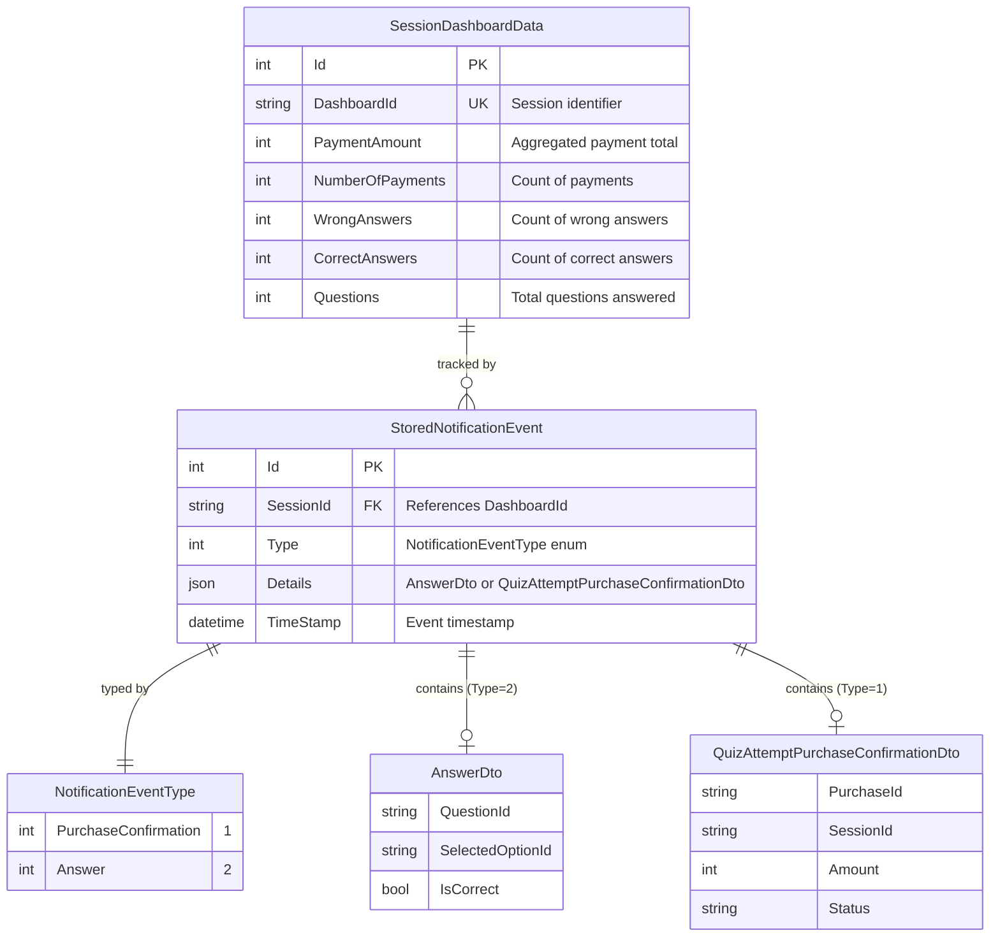
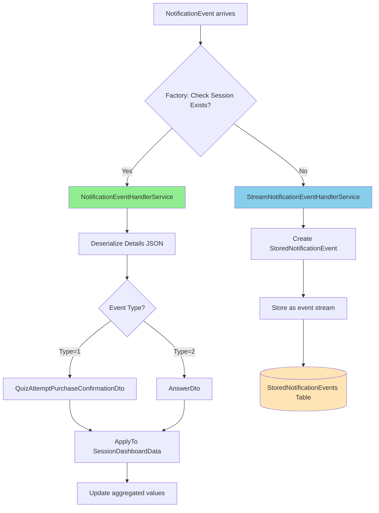

# Notification Events - ER Diagram

## Entity Relationship Diagram



## Data Flow



## Details JSON Structure

### For Type = 1 (PurchaseConfirmation)
```json
{
  "purchaseId": "string",
  "sessionId": "string",
  "amount": 0,
  "status": "string"
}
```

### For Type = 2 (Answer)
```json
{
  "questionId": "string",
  "selectedOptionId": "string",
  "isCorrect": true
}
```

## Storage Strategy

| Session Status | Handler Service | Action |
|---------------|----------------|--------|
| **New Session** (not exists) | `StreamNotificationEventHandlerService` | Store events as stream in `StoredNotificationEvents` table with JSON details |
| **Existing Session** | `NotificationEventHandlerService` | Deserialize JSON, apply updates to aggregated `SessionDashboardData` |

## Database Schema

### StoredNotificationEvents Table
```sql
CREATE TABLE StoredNotificationEvents (
    Id INT PRIMARY KEY IDENTITY(1,1),
    SessionId NVARCHAR(MAX) NOT NULL,
    Type INT NOT NULL,
    Details JSON NOT NULL,  -- Native JSON column type
    TimeStamp DATETIME2 NOT NULL
);

-- Recommended index for session queries
CREATE INDEX IX_StoredNotificationEvents_SessionId_TimeStamp 
ON StoredNotificationEvents(SessionId, TimeStamp);
```

### SessionDashboardData Table
```sql
CREATE TABLE SessionDashboardData (
    Id INT PRIMARY KEY IDENTITY(1,1),
    DashboardId NVARCHAR(MAX) NOT NULL,
    PaymentAmount INT NOT NULL DEFAULT 0,
    NumberOfPayments INT NOT NULL DEFAULT 0,
    WrongAnswers INT NOT NULL DEFAULT 0,
    CorrectAnswers INT NOT NULL DEFAULT 0,
    Questions INT NOT NULL DEFAULT 0
);
```

## Notes

- The `Details` column uses SQL Server's native **JSON** data type for efficient storage and querying
- `StoredNotificationEvent.SessionId` logically references `SessionDashboardData.DashboardId` but is not a formal FK constraint
- Events are stored chronologically ordered by `TimeStamp`
- The factory pattern allows different handling strategies based on session lifecycle
