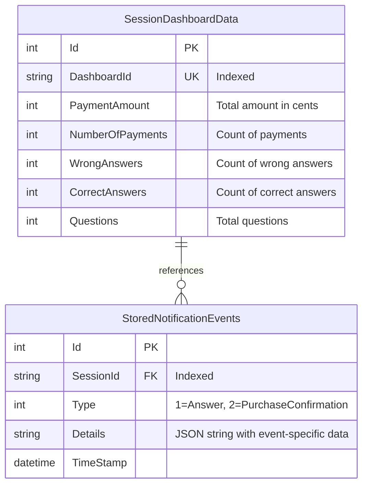

# Notification Events Storage Schema - ER Diagram (JSON-based)

## Entity Relationship Diagram



## Relationships

### SessionDashboardData ↔ StoredNotificationEvents (1:N)

Each `SessionDashboardData` is referenced by **many** `StoredNotificationEvents` via the `SessionId` string field.

**Relationship Type:** One-to-Many (logical, not enforced by FK)
**Note:** This is a string-based reference, not a database foreign key constraint

## Table Descriptions

### StoredNotificationEvents
**Purpose:** Main event table storing all notification events with details as JSON
**Key Points:**
- `SessionId` is indexed for efficient retrieval
- `Type` discriminator indicates event type:
  - `1` = Answer event
  - `2` = PurchaseConfirmation event
- `Details` stores event-specific data as JSON string
- `TimeStamp` allows chronological ordering

**Details JSON Structure by Type:**

**Type 1 (Answer):**
```json
{
  "questionId": "question-123",
  "selectedOptionId": "option-456",
  "isCorrect": true
}
```

**Type 2 (PurchaseConfirmation):**
```json
{
  "purchaseId": "purchase-789",
  "sessionId": "session-001",
  "amount": 2500,
  "status": "Confirmed"
}
```

### SessionDashboardData
**Purpose:** Aggregated dashboard metrics per session
**Key Points:**
- Stores cumulative statistics (for existing sessions)
- New sessions store events in stream form
- `DashboardId` matches `SessionId` in notification events
- All amounts stored in cents (integers)

## Data Flow

### New Session (Event Streaming):
1. Notification arrives for unknown `SessionId`
2. `StreamNotificationEventHandlerService` creates `StoredNotificationEvent`
3. Event stored with JSON `Details` and `Type` discriminator
4. Saved in single transaction

### Existing Session (Aggregation):
1. Notification arrives for known `SessionId`
2. `NotificationEventHandlerService` deserializes `Details` JSON
3. Updates `SessionDashboardData` counters directly
4. No event streaming occurs

### Retrieval for UI:
1. Controller queries `SessionDashboardData` for metrics
2. Controller queries `StoredNotificationEvents` for event stream
3. Each event's `Details` JSON is deserialized to DTO via `GetDetailsAs<T>()`
4. Combined data returned to frontend

## Query Patterns

### Get all events for a session:
```sql
SELECT *
FROM StoredNotificationEvents
WHERE SessionId = 'session-001'
ORDER BY TimeStamp
```

### Get only answer events:
```sql
SELECT *
FROM StoredNotificationEvents
WHERE SessionId = 'session-001'
  AND Type = 1
ORDER BY TimeStamp
```

**Note:** To filter by JSON content, you'd need:
- SQL Server: `JSON_VALUE(Details, '$.questionId') = 'q-123'`
- PostgreSQL: `Details::json->>'questionId' = 'q-123'`

## Code-Level Deserialization

The `StoredNotificationEvent` class provides methods to deserialize the JSON:

```csharp
// Generic deserialization
var answerDto = storedEvent.GetDetailsAs<AnswerDto>();

// Typed deserialization based on Type field
ISessionDashboardUpdate update = storedEvent.GetTypedDetails();
```

## Design Characteristics

### Advantages:
1. **Simple Schema**: Only 2 tables
2. **Flexible**: Easy to add new fields to JSON without migrations
3. **Single Row Per Event**: No joins needed to get full event data
4. **Fast Writes**: No foreign key validation overhead

### Trade-offs:
1. **No Type Safety**: Database doesn't validate JSON structure
2. **Query Complexity**: Harder to query/filter on JSON fields
3. **No Indexes**: Can't easily index fields within JSON
4. **Deserialization Overhead**: JSON parsing required on every read
5. **Storage Efficiency**: JSON strings may use more space than typed columns

## Migration Path

If you need to query frequently on detail fields, consider migrating to separate typed tables:
- `StoredAnswerDetails` for answer-specific fields
- `StoredPurchaseConfirmationDetails` for purchase-specific fields

This would provide:
- Database-level validation
- Direct querying without JSON parsing
- Better indexing capabilities
- Type safety at database level

## Factory Pattern for Handler Selection

```
┌─────────────────────────────────────────┐
│  NotificationEventListener              │
│  (receives event from RabbitMQ)         │
└──────────────┬──────────────────────────┘
               │
               ▼
┌─────────────────────────────────────────┐
│  NotificationEventHandlerServiceFactory │
│  (checks if session exists)             │
└──────────┬─────────────┬────────────────┘
           │             │
  Session  │             │  Session
  EXISTS   │             │  DOES NOT EXIST
           ▼             ▼
┌──────────────────┐  ┌───────────────────────────┐
│ Aggregation      │  │ Stream                    │
│ Handler          │  │ Handler                   │
│                  │  │                           │
│ Updates counters │  │ Stores to                 │
│ in               │  │ StoredNotificationEvents  │
│ SessionDashboard │  │ with JSON Details         │
│ Data             │  │                           │
└──────────────────┘  └───────────────────────────┘
```

## Storage Statistics

**Approximate storage per event:**

| Type | JSON Size | Total Row Size |
|------|-----------|----------------|
| Answer | ~80 bytes | ~120 bytes |
| PurchaseConfirmation | ~100 bytes | ~140 bytes |

**Note:** Actual size depends on string lengths in the JSON data.

## Indexes

**Current indexes:**
- `StoredNotificationEvents.Id` (Primary Key, clustered)
- `StoredNotificationEvents.SessionId` (Non-clustered)

**Recommended additional indexes (if query performance needed):**
- Composite index on `(SessionId, Type, TimeStamp)` for filtered queries
- Full-text index on `Details` (if text search required)
