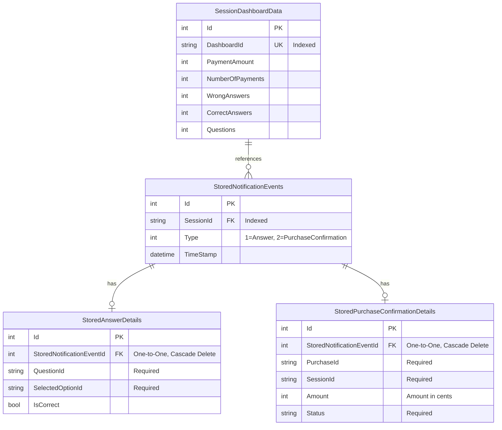

# Notification Events Storage Schema - ER Diagram

## Entity Relationship Diagram



## Relationships

### StoredNotificationEvents ↔ Detail Tables (1:1)

Each `StoredNotificationEvent` can have **either**:
- ONE `StoredAnswerDetails` (when Type = 1)
- OR ONE `StoredPurchaseConfirmationDetails` (when Type = 2)

**Relationship Type:** One-to-One (optional)
**Delete Behavior:** Cascade (deleting event deletes details)

### SessionDashboardData ↔ StoredNotificationEvents (1:N)

Each `SessionDashboardData` is referenced by **many** `StoredNotificationEvents` via the `SessionId` string field.

**Relationship Type:** One-to-Many (logical, not enforced by FK)
**Note:** This is a string-based reference, not a database foreign key constraint

## Table Descriptions

### StoredNotificationEvents
**Purpose:** Main event table storing all notification events
**Key Points:**
- `SessionId` is indexed for efficient retrieval
- `Type` discriminator determines which detail table contains the event data
- `TimeStamp` allows chronological ordering

### StoredAnswerDetails
**Purpose:** Stores answer-specific data for quiz attempts
**Key Points:**
- Contains question and option IDs
- Records whether the answer was correct
- Only exists when parent event Type = 1 (Answer)

### StoredPurchaseConfirmationDetails
**Purpose:** Stores purchase/payment confirmation data
**Key Points:**
- Contains purchase transaction details
- Stores amount in cents (integer)
- Only exists when parent event Type = 2 (PurchaseConfirmation)

### SessionDashboardData
**Purpose:** Aggregated dashboard metrics per session
**Key Points:**
- Stores cumulative statistics (for existing sessions)
- New sessions store events in stream form
- `DashboardId` matches `SessionId` in notification events

## Data Flow

### New Session (Event Streaming):
1. Notification arrives for unknown SessionId
2. `StreamNotificationEventHandlerService` creates `StoredNotificationEvent`
3. Based on `Type`, creates corresponding detail record
4. Both saved in single transaction

### Existing Session (Aggregation):
1. Notification arrives for known SessionId
2. `NotificationEventHandlerService` updates `SessionDashboardData` counters
3. No event streaming occurs

### Retrieval for UI:
1. Controller queries `SessionDashboardData` for metrics
2. Controller queries `StoredNotificationEvents` with `.Include()` for details
3. Details converted back to DTOs via `ToDto()` methods
4. Combined data returned to frontend

## Query Patterns

### Get all events for a session:
```sql
SELECT e.*, a.*, p.*
FROM StoredNotificationEvents e
LEFT JOIN StoredAnswerDetails a ON e.Id = a.StoredNotificationEventId
LEFT JOIN StoredPurchaseConfirmationDetails p ON e.Id = p.StoredNotificationEventId
WHERE e.SessionId = 'session-001'
ORDER BY e.TimeStamp
```

### Get only answer events:
```sql
SELECT e.*, a.*
FROM StoredNotificationEvents e
INNER JOIN StoredAnswerDetails a ON e.Id = a.StoredNotificationEventId
WHERE e.SessionId = 'session-001'
  AND e.Type = 1
ORDER BY e.TimeStamp
```

## Design Rationale

### Why Separate Tables?
1. **Type Safety**: Database enforces required fields for each event type
2. **Performance**: No JSON parsing during queries; can filter on typed columns
3. **Integrity**: Database constraints prevent invalid data
4. **Queryability**: Can directly query/aggregate on detail properties
5. **Extensibility**: Add new event types by creating new detail tables

### Why One-to-One Instead of Inheritance (TPH/TPT)?
1. **Flexibility**: Easier to add new event types without migration complexity
2. **Clarity**: Explicit relationship between event and details
3. **EF Core Compatibility**: Simpler configuration with owned entities
4. **Null Handling**: Clear that each event has exactly one detail type

### Why Not JSON Column?
The previous approach stored `Details` as JSON string. This new approach provides:
- ✅ Database-level validation
- ✅ Direct querying without deserialization
- ✅ Better indexing capabilities
- ✅ Type safety at database level
- ✅ Easier data integrity checks
