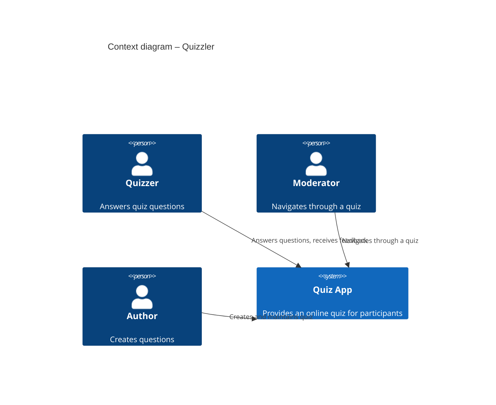
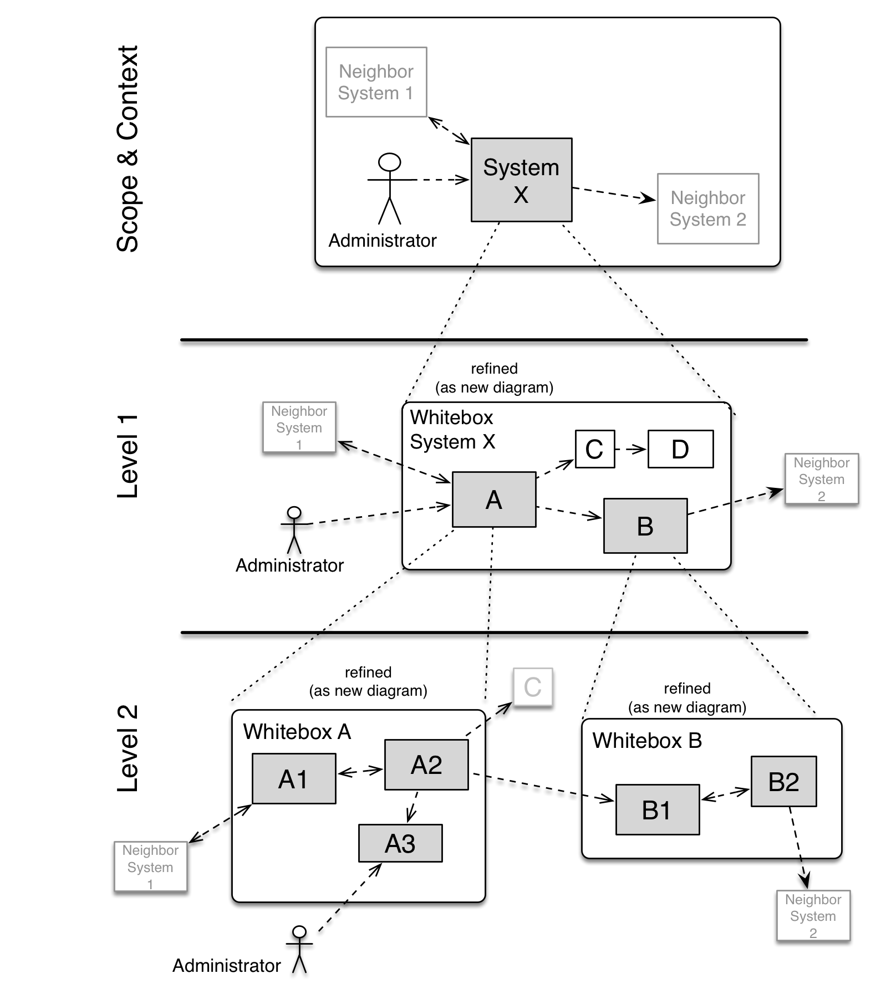
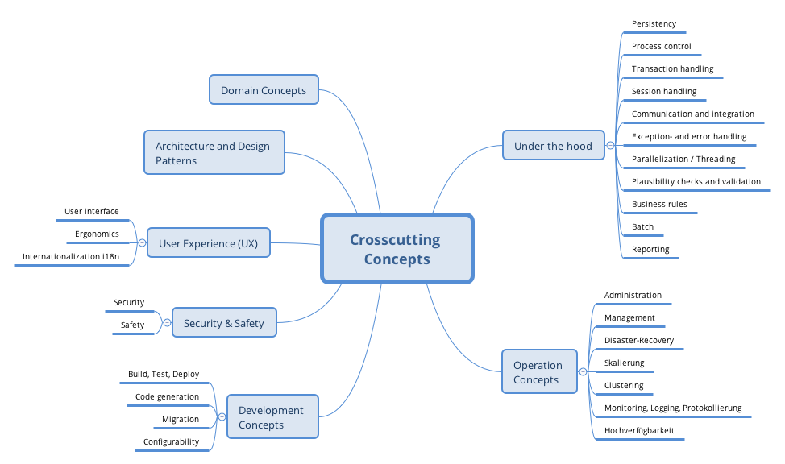

> **Note**
>
> This version of the template contains some help and explanations. It
> is used for familiarization with arc42 and the understanding of the
> concepts. For documentation of your own system you use better the
> *plain* version.

Introduction and Goals
======================

The tool is intended to run a quizz with multiple participants (quizzers).

The moderator can guide and synchronize multiple quizzers through a quizz by enabling questions step by step.
This way all quizzlers are working on the same question simultaniously and if and only if the moderator enables the next question for all of them, they can proceed together with the quizz. 

Requirements Overview
---------------------

-   The quizzers have to join a quizz
-   The moderator navigates through the questions
-   Whenever a participant submits an answer the evaluation is displayed as response to the participant
-   The moderator gets a statistic that shows the distribution of selected answers

Quality Goals 
-------------

**Contents.**

The top three (max five) quality goals for the architecture whose
fulfillment is of highest importance to the major stakeholders. We
really mean quality goals for the architecture. Don’t confuse them with
project goals. They are not necessarily identical.

**Motivation.**

You should know the quality goals of your most important stakeholders,
since they will influence fundamental architectural decisions. Make sure
to be very concrete about these qualities, avoid buzzwords. If you as an
architect do not know how the quality of your work will be judged …

**Form.**

A table with quality goals and concrete scenarios, ordered by priorities

Stakeholders
------------

**Contents.**

Explicit overview of stakeholders of the system, i.e. all person, roles
or organizations that

-   should know the architecture

-   have to be convinced of the architecture

-   have to work with the architecture or with code

-   need the documentation of the architecture for their work

-   have to come up with decisions about the system or its development

**Motivation.**

You should know all parties involved in development of the system or
affected by the system. Otherwise, you may get nasty surprises later in
the development process. These stakeholders determine the extent and the
level of detail of your work and its results.

**Form.**

Table with role names, person names, and their expectations with respect
to the architecture and its documentation.

| Role/Name   | Contact                   | Expectations              |
| ----------- | ------------------------- | ------------------------- |
| Trainer / Andreas Kleinbichler    | AndiKleini                  | *&lt;Wants to check whether all participants share a common understanding of the topics.&gt;   |
| Role-2      | Contact-2                 | *&lt;Expectation-2*&gt;   |

Architecture Constraints
========================

**Contents.**

Any requirement that constrains software architects in their freedom of
design and implementation decisions or decision about the development
process. These constraints sometimes go beyond individual systems and
are valid for whole organizations and companies.

**Motivation.**

Architects should know exactly where they are free in their design
decisions and where they must adhere to constraints. Constraints must
always be dealt with; they may be negotiable, though.

**Form.**

Simple tables of constraints with explanations. If needed you can
subdivide them into technical constraints, organizational and political
constraints and conventions (e.g. programming or versioning guidelines,
documentation or naming conventions)

System Scope and Context
========================

**Contents.**

System scope and context - as the name suggests - delimits your system
(i.e. your scope) from all its communication partners (neighboring
systems and users, i.e. the context of your system). It thereby
specifies the external interfaces.

If necessary, differentiate the business context (domain specific inputs
and outputs) from the technical context (channels, protocols, hardware).

**Motivation.**

The domain interfaces and technical interfaces to communication partners
are among your system’s most critical aspects. Make sure that you
completely understand them.

**Form.**

Various options:

-   Context diagrams

-   Lists of communication partners and their interfaces.

Business Context
----------------

**Contents.**

Specification of **all** communication partners (users, IT-systems, …)
with explanations of domain specific inputs and outputs or interfaces.
Optionally you can add domain specific formats or communication
protocols.

**Motivation.**

All stakeholders should understand which data are exchanged with the
environment of the system.

**Form.**

All kinds of diagrams that show the system as a black box and specify
the domain interfaces to communication partners.

Alternatively (or additionally) you can use a table. The title of the
table is the name of your system, the three columns contain the name of
the communication partner, the inputs, and the outputs.

**&lt;Diagram or Table&gt;**

**&lt;optionally: Explanation of external domain interfaces&gt;**

Technical Context
-----------------

**Business Context**



**Contents.**

Technical interfaces (channels and transmission media) linking your
system to its environment. In addition a mapping of domain specific
input/output to the channels, i.e. an explanation with I/O uses which
channel.

**Motivation.**

Many stakeholders make architectural decision based on the technical
interfaces between the system and its context. Especially infrastructure
or hardware designers decide these technical interfaces.

**Form.**

E.g. UML deployment diagram describing channels to neighboring systems,
together with a mapping table showing the relationships between channels
and input/output.

**&lt;Diagram or Table&gt;**

**&lt;optionally: Explanation of technical interfaces&gt;**

**&lt;Mapping Input/Output to Channels&gt;**

Solution Strategy
=================

**Product iterations**

It is planned to deliver the product in iterations:

- ***Version 1:*** 
Users can enter a single quizzround and go through the questions on their own. After each submission the result is diplayed.

**Technology stack**
- Java Springboot for API
- Angular for FE (Web)
- PostgreSQL

Building Block View
===================

**quizzlerapi**

Provides the server side backend to the frontend.

**Content.**

The building block view shows the static decomposition of the system
into building blocks (modules, components, subsystems, classes,
interfaces, packages, libraries, frameworks, layers, partitions, tiers,
functions, macros, operations, datas structures, …) as well as their
dependencies (relationships, associations, …)

This view is mandatory for every architecture documentation. In analogy
to a house this is the *floor plan*.

**Motivation.**

Maintain an overview of your source code by making its structure
understandable through abstraction.

This allows you to communicate with your stakeholder on an abstract
level without disclosing implementation details.

**Form.**

The building block view is a hierarchical collection of black boxes and
white boxes (see figure below) and their descriptions.



**Level 1** is the white box description of the overall system together
with black box descriptions of all contained building blocks.

**Level 2** zooms into some building blocks of level 1. Thus it contains
the white box description of selected building blocks of level 1,
together with black box descriptions of their internal building blocks.

**Level 3** zooms into selected building blocks of level 2, and so on.

Whitebox Overall System
-----------------------

quizzlerui

quizzlerapi

quizzlerdb

Here you describe the decomposition of the overall system using the
following white box template. It contains

-   an overview diagram

-   a motivation for the decomposition

-   black box descriptions of the contained building blocks. For these
    we offer you alternatives:

    -   use *one* table for a short and pragmatic overview of all
        contained building blocks and their interfaces

    -   use a list of black box descriptions of the building blocks
        according to the black box template (see below). Depending on
        your choice of tool this list could be sub-chapters (in text
        files), sub-pages (in a Wiki) or nested elements (in a modeling
        tool).

-   (optional:) important interfaces, that are not explained in the
    black box templates of a building block, but are very important for
    understanding the white box. Since there are so many ways to specify
    interfaces why do not provide a specific template for them. In the
    worst case you have to specify and describe syntax, semantics,
    protocols, error handling, restrictions, versions, qualities,
    necessary compatibilities and many things more. In the best case you
    will get away with examples or simple signatures.

***&lt;Overview Diagram&gt;***

Motivation

:   *&lt;text explanation&gt;*

Contained Building Blocks

:   *&lt;Description of contained building block (black boxes)&gt;*

Important Interfaces

:   *&lt;Description of important interfaces&gt;*

Insert your explanations of black boxes from level 1:

If you use tabular form you will only describe your black boxes with
name and responsibility according to the following schema:

| **Name**             | **Responsibility**                           |
| -------------------- | -------------------------------------------- |
| Black Box 1          |  *&lt;Text&gt;*                              |
| Black Box 2          |  *&lt;Text&gt;*                              |

If you use a list of black box descriptions then you fill in a separate
black box template for every important building block . Its headline is
the name of the black box.

### &lt;Name black box 1&gt; 

Here you describe &lt;black box 1&gt; according the the following black
box template:

-   Purpose/Responsibility

-   Interface(s), when they are not extracted as separate paragraphs.
    This interfaces may include qualities and performance
    characteristics.

-   (Optional) Quality-/Performance characteristics of the black box,
    e.g.availability, run time behavior, ….

-   (Optional) directory/file location

-   (Optional) Fulfilled requirements (if you need traceability to
    requirements).

-   (Optional) Open issues/problems/risks

*&lt;Purpose/Responsibility&gt;*

*&lt;Interface(s)&gt;*

*&lt;(Optional) Quality/Performance Characteristics&gt;*

*&lt;(Optional) Directory/File Location&gt;*

*&lt;(Optional) Fulfilled Requirements&gt;*

*&lt;(optional) Open Issues/Problems/Risks&gt;*

### &lt;Name black box 2&gt; 

*&lt;black box template&gt;*

### &lt;Name black box n&gt; 

*&lt;black box template&gt;*

### &lt;Name interface 1&gt; 

…

### &lt;Name interface m&gt; 

Level 2 
-------

Here you can specify the inner structure of (some) building blocks from
level 1 as white boxes.

You have to decide which building blocks of your system are important
enough to justify such a detailed description. Please prefer relevance
over completeness. Specify important, surprising, risky, complex or
volatile building blocks. Leave out normal, simple, boring or
standardized parts of your system

### White Box *&lt;building block 1&gt;* 

…describes the internal structure of *building block 1*.

*&lt;white box template&gt;*

### White Box *&lt;building block 2&gt;* 

*&lt;white box template&gt;*

…

### White Box *&lt;building block m&gt;* 

*&lt;white box template&gt;*

Level 3 
-------

Here you can specify the inner structure of (some) building blocks from
level 2 as white boxes.

When you need more detailed levels of your architecture please copy this
part of arc42 for additional levels.

### White Box &lt;\_building block x.1\_&gt; 

Specifies the internal structure of *building block x.1*.

*&lt;white box template&gt;*

### White Box &lt;\_building block x.2\_&gt; 

*&lt;white box template&gt;*

### White Box &lt;\_building block y.1\_&gt; 

*&lt;white box template&gt;*

Runtime View 
============

**Contents.**

The runtime view describes concrete behavior and interactions of the
system’s building blocks in form of scenarios from the following areas:

-   important use cases or features: how do building blocks execute
    them?

-   interactions at critical external interfaces: how do building blocks
    cooperate with users and neighboring systems?

-   operation and administration: launch, start-up, stop

-   error and exception scenarios

Remark: The main criterion for the choice of possible scenarios
(sequences, workflows) is their **architectural relevance**. It is
**not** important to describe a large number of scenarios. You should
rather document a representative selection.

**Motivation.**

You should understand how (instances of) building blocks of your system
perform their job and communicate at runtime. You will mainly capture
scenarios in your documentation to communicate your architecture to
stakeholders that are less willing or able to read and understand the
static models (building block view, deployment view).

**Form.**

There are many notations for describing scenarios, e.g.

-   numbered list of steps (in natural language)

-   activity diagrams or flow charts

-   sequence diagrams

-   BPMN or EPCs (event process chains)

-   state machines

-   …

&lt;Runtime Scenario 1&gt;
--------------------------

-   *&lt;insert runtime diagram or textual description of the
    scenario&gt;*

-   *&lt;insert description of the notable aspects of the interactions
    between the building block instances depicted in this diagram.&gt;*

&lt;Runtime Scenario 2&gt; 
--------------------------

… {#_}
-

&lt;Runtime Scenario n&gt; 
--------------------------

Deployment View 
===============

**Content.**

The deployment view describes:

1.  the technical infrastructure used to execute your system, with
    infrastructure elements like geographical locations, environments,
    computers, processors, channels and net topologies as well as other
    infrastructure elements and

2.  the mapping of (software) building blocks to that infrastructure
    elements.

Often systems are executed in different environments, e.g. development
environment, test environment, production environment. In such cases you
should document all relevant environments.

Especially document the deployment view when your software is executed
as distributed system with more then one computer, processor, server or
container or when you design and construct your own hardware processors
and chips.

From a software perspective it is sufficient to capture those elements
of the infrastructure that are needed to show the deployment of your
building blocks. Hardware architects can go beyond that and describe the
infrastructure to any level of detail they need to capture.

**Motivation.**

Software does not run without hardware. This underlying infrastructure
can and will influence your system and/or some cross-cutting concepts.
Therefore, you need to know the infrastructure.

Maybe the highest level deployment diagram is already contained in
section 3.2. as technical context with your own infrastructure as ONE
black box. In this section you will zoom into this black box using
additional deployment diagrams:

-   UML offers deployment diagrams to express that view. Use it,
    probably with nested diagrams, when your infrastructure is more
    complex.

-   When your (hardware) stakeholders prefer other kinds of diagrams
    rather than the deployment diagram, let them use any kind that is
    able to show nodes and channels of the infrastructure.

Infrastructure Level 1 
----------------------

Describe (usually in a combination of diagrams, tables, and text):

-   the distribution of your system to multiple locations, environments,
    computers, processors, .. as well as the physical connections
    between them

-   important justification or motivation for this deployment structure

-   Quality and/or performance features of the infrastructure

-   the mapping of software artifacts to elements of the infrastructure

For multiple environments or alternative deployments please copy that
section of arc42 for all relevant environments.

***&lt;Overview Diagram&gt;***

Motivation

:   *&lt;explanation in text form&gt;*

Quality and/or Performance Features

:   *&lt;explanation in text form&gt;*

Mapping of Building Blocks to Infrastructure

:   *&lt;description of the mapping&gt;*

Infrastructure Level 2 
----------------------

Here you can include the internal structure of (some) infrastructure
elements from level 1.

Please copy the structure from level 1 for each selected element.

### *&lt;Infrastructure Element 1&gt;* 

*&lt;diagram + explanation&gt;*

### *&lt;Infrastructure Element 2&gt;* 

*&lt;diagram + explanation&gt;*

…

### *&lt;Infrastructure Element n&gt;* 

*&lt;diagram + explanation&gt;*

Cross-cutting Concepts 
======================

**Basic Architecture**

Follows the principle of clean architecture.
Having separate packages for entities representing the core business logic.
Implementing concrete use cases in separate packages.
The direction of dependency is use cases -> entities.

**Domain Model**

***Core domains***

***Domain question-bank*** 
The quiz domain is our code domain. It provides the questions and answers.
It contains following list of entities:
- question (can be a single pick, multiple pick or decision question, has one solution)
- evaluation (evaluates the provided answers of a question)
- solution (provides the solution to the question, solves one question)

***Domain quiz***
The quiz-run domain supports quizz runs by connection quizz, moderator and participants to a run.
It contains following entities:
- quizz (a quizz contains a collection of questions )
- quizzrun (represents a run of a quizz
- moderator
- participant

**Angular design principles**
This section is dedicated to applied design principles for the angular ui.

- questions are presented and submitted as angular forms (reactive forms)
- semantic correctness of selections in questions (e.g. selection of requested number of correct options) are validated by
form validation (e.g.: number of currently selected options exceeds the max number of correct options -> one selection is false for sure and would lead to 0 point when submitted)
- signals are the preferred way of handling state in components; component fields that represent state are declared as `signal`/`computed` rather than plain properties
- conversion from `Observable` to signal via `toSignal` is performed in the component (not in the service); services keep their `Observable<T>` return types, and the component is the layer that subscribes by binding the stream to a signal

**Unit testing**
This section captures the conventions used for unit tests across the system. They apply to all back-end JUnit tests; the same spirit applies to Angular Jest tests where the tooling allows.

- *Object graph comparison for assertions*: a test asserts the **whole expected result object** against the actual result in a single comparison, rather than asserting field-by-field. On the back-end this is done with AssertJ's `assertThat(actual).usingRecursiveComparison().isEqualTo(expected)`. The expected object is built explicitly in the test body so the reader can see the full shape that is being verified. This keeps tests resilient to internal refactorings (no churn when fields are added) while still failing loudly when the contract changes.
- *Readable test method naming*: test methods follow the schema `methodUnderTest_when_condition_then_outcome` (or the shorter `methodUnderTest_condition_outcome`) with snake_case separators, e.g. `getSinglePickQuestion_which_exists_is_returned`, `getSinglePickQuestion_when_not_exists_throws`. The intent is that the method name reads as a sentence describing the scenario, so a test report acts as a behavioural specification of the system.
- *One scenario per test*: each test covers a single behavioural scenario (one happy path, one sad path, …). All assertions for that scenario live in the same test method — typically a single object-graph comparison plus, where applicable, an exception assertion. Granular per-field tests and defensive/meta tests (e.g. reflection-based DTO surface checks) are avoided.
- *Pure unit tests for service-layer code*: services are exercised without a Spring context — `@ExtendWith(MockitoExtension.class)` plus `@Mock` for collaborators and `@InjectMocks` for the unit under test. JPA-generated `id` fields are set with `ReflectionTestUtils.setField` rather than introducing test-only setters on production entities.

The `createSession_assigns_a_question_as_current_without_neighbours` test from `QuizSessionServiceTest` shows the pattern:

```java
@ExtendWith(MockitoExtension.class)
class QuizSessionServiceTest {

    @Mock
    private QuizSessionRepository quizSessionRepository;

    @Mock
    private QuestionRepository questionRepository;

    @InjectMocks
    private QuizSessionService quizSessionService;

    @Test
    void createSession_assigns_a_question_as_current_without_neighbours() {
        SinglePickQuestion question = new SinglePickQuestion("Title", "Text");
        ReflectionTestUtils.setField(question, "id", 42L);
        QuizSessionDto expected = new QuizSessionDto(SESSION_PUBLIC_ID, 42L, 0L, 0L);
        when(questionRepository.findAll()).thenReturn(List.of(question));
        when(quizSessionRepository.save(any(QuizSession.class))).thenAnswer(call -> call.getArgument(0));

        QuizSessionDto dto = quizSessionService.createSession();

        assertThat(dto.getPublicId()).isNotBlank();
        assertThat(dto).usingRecursiveComparison().ignoringFields("publicId").isEqualTo(expected);
    }
}
```

- *Component tests for the back-end through its HTTP surface*: a controller and the slice of the system behind it (service, repository, persistence) are tested together as one component, exercised only through the REST API — never by calling Java methods directly. The full application is started with `@SpringBootTest(webEnvironment = RANDOM_PORT)` and `@AutoConfigureWebTestClient`; an in-memory H2 database (`src/test/resources/application.properties`) replaces PostgreSQL so the test owns its data. Requests are issued with an injected `WebTestClient`, fixtures are seeded and cleared per test via the real repositories in a `@BeforeEach`, and the response body is asserted as a DTO with the object-graph comparison above. `QuizSessionControllerTest` is the reference example: it drives `POST /session` and `GET /session/{publicId}` end to end, seeds exactly one question so the randomly assigned `currentQuestion` is deterministic, and excludes the server-generated `publicId` from the recursive comparison (`ignoringFields("publicId")`) while still asserting it is non-blank.

The `createSession_assigns_the_only_question_as_current` test from `QuizSessionControllerTest` shows the pattern:

```java
@SpringBootTest(webEnvironment = SpringBootTest.WebEnvironment.RANDOM_PORT)
@AutoConfigureWebTestClient
public class QuizSessionControllerTest {

    @Autowired
    private QuestionRepository questionRepository;

    @Autowired
    private QuizSessionRepository quizSessionRepository;

    private Long seededQuestionId;

    @BeforeEach
    void seedTestData() {
        quizSessionRepository.deleteAll();
        questionRepository.deleteAll();

        SinglePickQuestion question = new SinglePickQuestion(QUESTION_TITLE, QUESTION_TEXT);
        seededQuestionId = questionRepository.save(question).getId();
    }

    @Test
    public void createSession_assigns_the_only_question_as_current(@Autowired WebTestClient webTestClient) {
        QuizSessionDto expected = new QuizSessionDto(null, seededQuestionId, 0L, 0L);

        webTestClient.post().uri(SESSION).exchange()
                .expectStatus().isCreated()
                .expectBody(QuizSessionDto.class)
                .value(dto -> {
                    assertThat(dto.getPublicId()).isNotBlank();
                    assertThat(dto).usingRecursiveComparison()
                            .ignoringFields("publicId")
                            .isEqualTo(expected);
                });
    }
}
```

**Content.**

This section describes overall, principal regulations and solution ideas
that are relevant in multiple parts (= cross-cutting) of your system.
Such concepts are often related to multiple building blocks. They can
include many different topics, such as

-   domain models

-   architecture patterns or design patterns

-   rules for using specific technology

-   principal, often technical decisions of overall decisions

-   implementation rules

**Motivation.**

Concepts form the basis for *conceptual integrity* (consistency,
homogeneity) of the architecture. Thus, they are an important
contribution to achieve inner qualities of your system.

Some of these concepts cannot be assigned to individual building blocks
(e.g. security or safety). This is the place in the template that we
provided for a cohesive specification of such concepts.

**Form.**

The form can be varied:

-   concept papers with any kind of structure

-   cross-cutting model excerpts or scenarios using notations of the
    architecture views

-   sample implementations, especially for technical concepts

-   reference to typical usage of standard frameworks (e.g. using
    Hibernate for object/relational mapping)

**Structure.**

A potential (but not mandatory) structure for this section could be:

-   Domain concepts

-   User Experience concepts (UX)

-   Safety and security concepts

-   Architecture and design patterns

-   "Under-the-hood"

-   development concepts

-   operational concepts

Note: it might be difficult to assign individual concepts to one
specific topic on this list.



*&lt;Concept 1&gt;* 
-------------------

*&lt;explanation&gt;*

*&lt;Concept 2&gt;* 
-------------------

*&lt;explanation&gt;*

…

*&lt;Concept n&gt;* 
-------------------

*&lt;explanation&gt;*

Design Decisions 
================

- **Use gRPC** for realizing RPCs from the client to the backend. As upcoming versions may need bidirectional streaming capabilities (e.g.: collecting currently selected answers from all quizzers (answer collection)) and the interface should be ideomatic, gRPC was favoured over REST. 

-- **Use capabilities of angular forms for semantic validation** for semantic validation of questions (e.g.: if all requested options are selected) angular forms will be used. The special logic behind single pick, pick or decision questions regarding the number of options that can be selected is covered by form validation. Alternatively this validation logic could be seen as part of the model classes but this would lead unnecessary complexity and circumvent angular and html form caopabilities. 

Quality Requirements 
====================

**Content.**

This section contains all quality requirements as quality tree with
scenarios. The most important ones have already been described in
section 1.2. (quality goals)

Here you can also capture quality requirements with lesser priority,
which will not create high risks when they are not fully achieved.

**Motivation.**

Since quality requirements will have a lot of influence on architectural
decisions you should know for every stakeholder what is really important
to them, concrete and measurable.

Quality Tree 
------------

**Content.**

The quality tree (as defined in ATAM – Architecture Tradeoff Analysis
Method) with quality/evaluation scenarios as leafs.

**Motivation.**

The tree structure with priorities provides an overview for a sometimes
large number of quality requirements.

**Form.**

The quality tree is a high-level overview of the quality goals and
requirements:

-   tree-like refinement of the term "quality". Use "quality" or
    "usefulness" as a root

-   a mind map with quality categories as main branches

In any case the tree should include links to the scenarios of the
following section.

Quality Scenarios 
-----------------

**Contents.**

Concretization of (sometimes vague or implicit) quality requirements
using (quality) scenarios.

These scenarios describe what should happen when a stimulus arrives at
the system.

For architects, two kinds of scenarios are important:

-   Usage scenarios (also called application scenarios or use case
    scenarios) describe the system’s runtime reaction to a certain
    stimulus. This also includes scenarios that describe the system’s
    efficiency or performance. Example: The system reacts to a user’s
    request within one second.

-   Change scenarios describe a modification of the system or of its
    immediate environment. Example: Additional functionality is
    implemented or requirements for a quality attribute change.

**Motivation.**

Scenarios make quality requirements concrete and allow to more easily
measure or decide whether they are fulfilled.

Especially when you want to assess your architecture using methods like
ATAM you need to describe your quality goals (from section 1.2) more
precisely down to a level of scenarios that can be discussed and
evaluated.

**Form.**

Tabular or free form text.

Risks and Technical Debts 
=========================

**Contents.**

A list of identified technical risks or technical debts, ordered by
priority

**Motivation.**

“Risk management is project management for grown-ups” (Tim Lister,
Atlantic Systems Guild.)

This should be your motto for systematic detection and evaluation of
risks and technical debts in the architecture, which will be needed by
management stakeholders (e.g. project managers, product owners) as part
of the overall risk analysis and measurement planning.

**Form.**

List of risks and/or technical debts, probably including suggested
measures to minimize, mitigate or avoid risks or reduce technical debts.

Glossary 
========

**Contents.**

The most important domain and technical terms that your stakeholders use
when discussing the system.

You can also see the glossary as source for translations if you work in
multi-language teams.

**Motivation.**

You should clearly define your terms, so that all stakeholders

-   have an identical understanding of these terms

-   do not use synonyms and homonyms

**Form.**

A table with columns &lt;Term&gt; and &lt;Definition&gt;.

Potentially more columns in case you need translations.

| Term                              | Definition                        |
| --------------------------------- | --------------------------------- |
| Participant                           | A person that participates to a quizz in answering questions              |
| Quizz                             | A sequence of questions           |
| Quizzrun                          | A run through the questions of a quizz                  |


