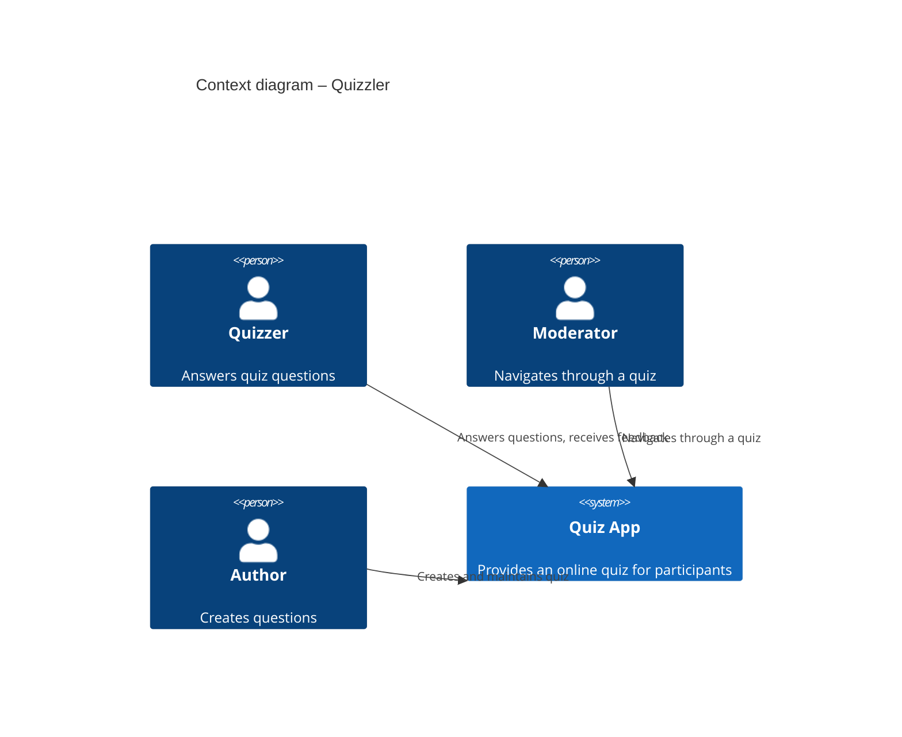
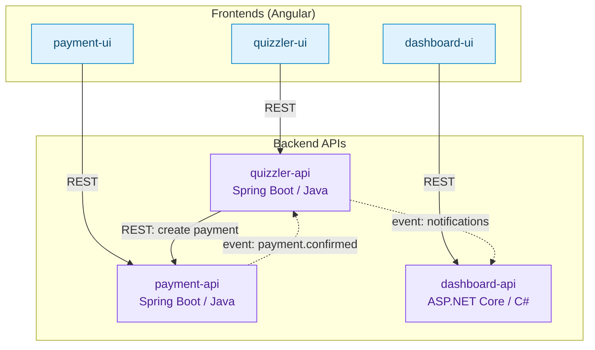
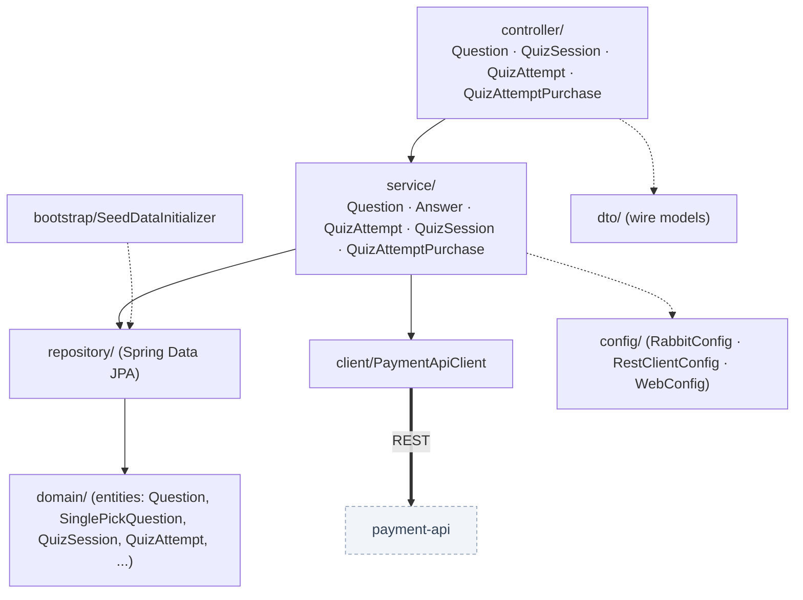
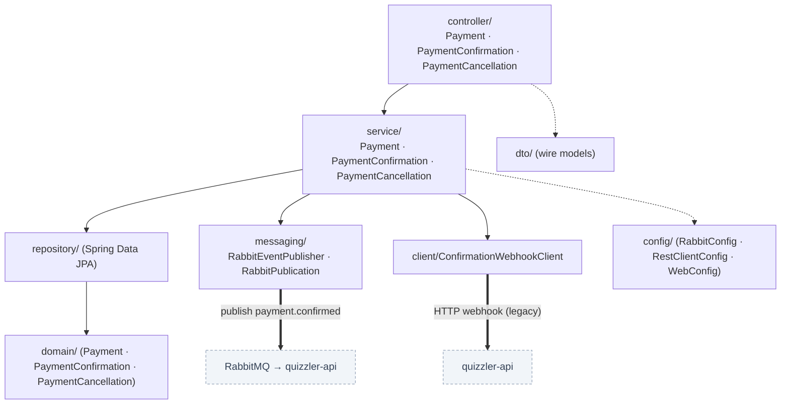
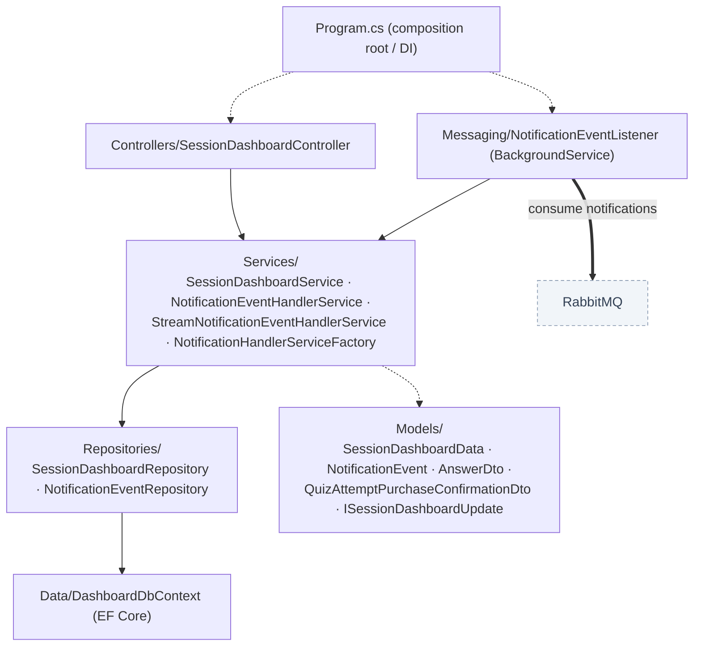
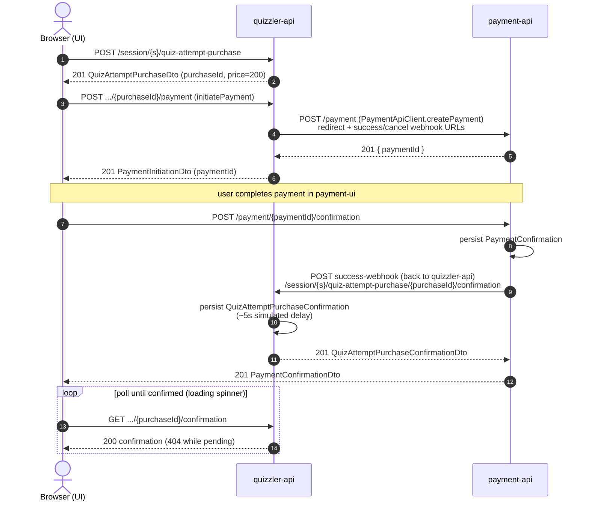
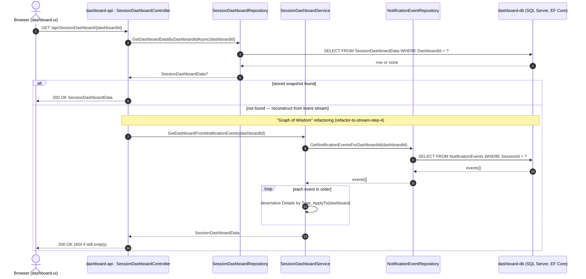
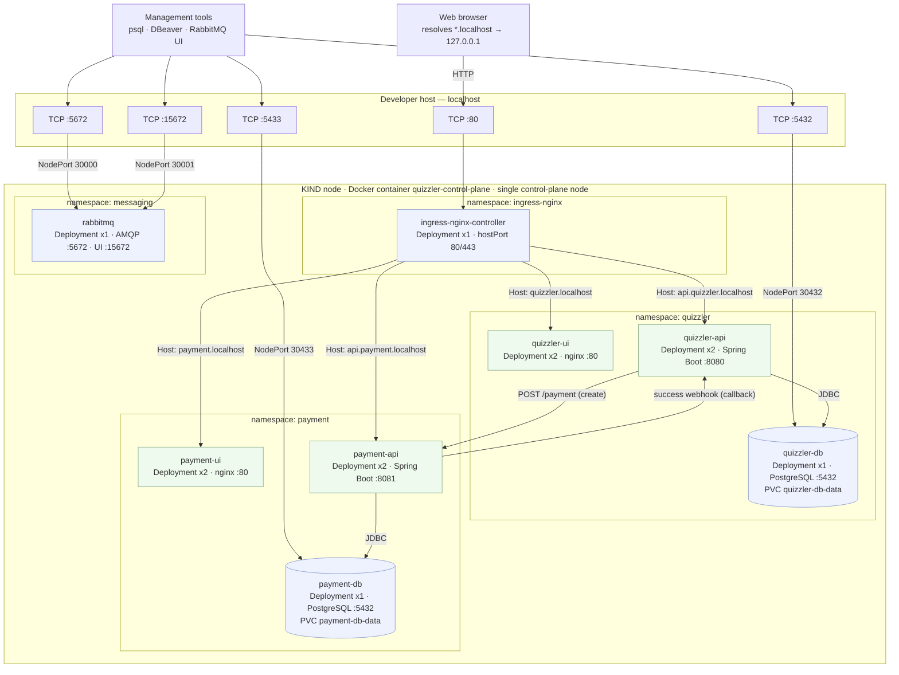
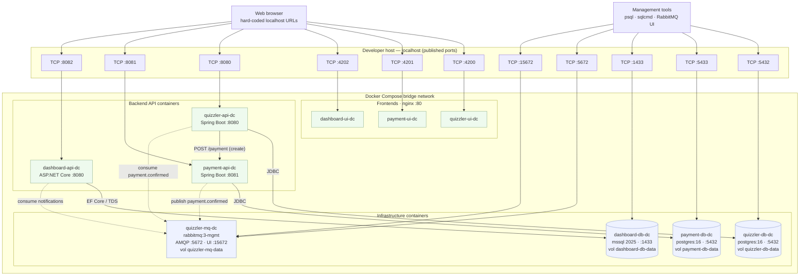

Introduction and Goals
======================

The tool is intended to run a quizz with multiple participants (quizzers).

The moderator can guide and synchronize multiple quizzers through a quizz by enabling questions step by step.
This way all quizzlers are working on the same question simultaniously and if and only if the moderator enables the next question for all of them, they can proceed together with the quizz. 

Requirements Overview
---------------------

-   The quizzers have to join a quizz
-   The moderator navigates through the questions
-   Whenever a participant submits an answer the evaluation is displayed as response to the participant
-   The moderator gets a statistic that shows the distribution of selected answers

Quality Goals 
-------------

The top three quality goals for the architecture, in priority order:

| Priority | Quality Goal | Motivation / Scenario |
| -------- | ------------ | --------------------- |
| 1 | **Availability** | A quiz session is live and time-boxed: participants and the moderator must be able to join, answer, and see results without interruption. The system stays responsive while a session runs, and a failure of one component (e.g. the payment or dashboard service) must not take down the ongoing quiz. |
| 2 | **Security** | Correct answers must never leak to participants before evaluation (DTOs hide `correctOptionId`), and payment/purchase data must be handled safely — e.g. a `TransactionId` is unique per payment so a purchase cannot be confirmed twice or replayed. |
| 3 | **Usability** | Both the moderator and the participants use the app under time pressure during a live session. Joining a quiz, submitting an answer, and reading the answer-distribution statistics must be simple, self-explanatory, and give immediate visual feedback (e.g. the loading spinner while a purchase is being confirmed). |

Stakeholders
------------

| Role/Name   | Contact                   | Expectations              |
| ----------- | ------------------------- | ------------------------- |
| Trainer / Andreas Kleinbichler    | AndiKleini                  | *&lt;Wants to check whether all participants share a common understanding of the topics.&gt;   |
| ...     | ...                 | ...   |

Architecture Constraints
========================

Is kept empty.

System Scope and Context
========================

Business Context
----------------

**Business Context**



Solution Strategy
=================

**Product iterations**

It is planned to deliver the product in iterations:

- ***Version 1:*** 
Users can enter a single quizzround and go through the questions on their own. After each submission the result is diplayed.

- ***Version 2:***
Has to be defined.

**Technology stack**
- Java Springboot for API
- Angular for FE (Web)
- PostgreSQL
- ASP .NET with EF
- SQL Server 2025

Building Block View
===================

The system is composed of three independent, self-contained web applications
(*quizzler*, *payment*, *dashboard*), each with an Angular frontend and a backend
API. They collaborate over synchronous REST calls and asynchronous messaging.

Level 1 — Whitebox Overall System
---------------------------------

Application building blocks only (infrastructure such as databases and the message
broker is intentionally omitted here — see the Deployment View for those).



Legend: **solid** = synchronous REST, **dashed** = asynchronous event (mediated by
the RabbitMQ broker, shown in the Deployment View).

| Building block | Responsibility |
| -------------- | -------------- |
| **quizzler-ui** | Angular SPA for participants/moderator: join a quiz, answer single-pick questions, see results. Talks to `quizzler-api` over REST. |
| **payment-ui** | Angular SPA for the payment/checkout flow (purchase a quiz attempt). Talks to `payment-api` over REST. |
| **dashboard-ui** | Angular SPA that visualizes a live session dashboard (answer distribution, purchases). Talks to `dashboard-api` over REST. |
| **quizzler-api** | Core domain backend: questions, quiz sessions, attempts, answers and purchases. Initiates payments on `payment-api` and consumes payment-confirmation events. |
| **payment-api** | Owns payments, confirmations and cancellations. Publishes `payment.confirmed` events (and historically calls back a success webhook). |
| **dashboard-api** | Consumes notification events and derives the session dashboard read model from them (event stream). |

> Two relationships are being reshaped by ongoing refactorings, documented in
> `refactorings/`: the payment→quizzler confirmation is moving from an HTTP webhook
> to the `payment.confirmed` event (*"Loading Spinner on the Move"*), and the
> dashboard is being fed by a notification event stream (*"Graph of Wisdom"*).

Level 2 — Internal Structure of the Backends
--------------------------------------------

### quizzler-api (`com.quizzler.api`)

Classic layered Spring Boot application (controller → service → repository → domain).



| Component | Responsibility |
| --------- | -------------- |
| `controller/` | REST endpoints (questions, sessions, attempts, purchases). Maps to/from DTOs only. |
| `service/` | Business logic; `QuizAttemptPurchaseService` initiates payment via `PaymentApiClient`. |
| `repository/` | `JpaRepository` interfaces over the domain entities. |
| `domain/` | JPA entities; `Question` is abstract (JOINED inheritance) with `SinglePickQuestion`. |
| `dto/` | Wire-format types; `SinglePickQuestionDto` deliberately omits `correctOptionId`. |
| `client/` | `PaymentApiClient` — outbound REST client to `payment-api`. |
| `config/` | `RabbitConfig` (payment-confirmed consumer topology), `RestClientConfig`, `WebConfig` (CORS). |
| `bootstrap/` | `SeedDataInitializer` — idempotent seed data on first startup. |

### payment-api (`com.quizzler.payment`)

Layered Spring Boot application with an outbound webhook client and a RabbitMQ publisher.



| Component | Responsibility |
| --------- | -------------- |
| `controller/` | REST endpoints for payment, confirmation and cancellation. |
| `service/` | Business logic; `PaymentConfirmationService` persists the confirmation and emits the event. |
| `repository/` | `JpaRepository` interfaces over payment entities. |
| `domain/` | JPA entities: `Payment`, `PaymentConfirmation`, `PaymentCancellation`. |
| `dto/` | Wire-format request/response types. |
| `messaging/` | `RabbitEventPublisher` / `RabbitPublication` — publishes `payment.confirmed` to the topic exchange. |
| `client/` | `ConfirmationWebhookClient` — legacy HTTP callback to quizzler-api (being retired). |
| `config/` | `RabbitConfig` (exchange), `RestClientConfig`, `WebConfig`. |

### dashboard-api (`Dashboard`, ASP.NET Core)

ASP.NET Core Web API with EF Core persistence and a hosted RabbitMQ consumer that
builds the session read model from a stream of notification events.



| Component | Responsibility |
| --------- | -------------- |
| `Controllers/` | `SessionDashboardController` — REST endpoint returning the session dashboard. |
| `Services/` | Read-model logic; `SessionDashboardService` folds notification events into `SessionDashboardData`; the factory selects stored vs. stream handler. |
| `Repositories/` | EF Core-backed access to stored dashboards and persisted notification events. |
| `Data/` | `DashboardDbContext` — EF Core context over SQL Server. |
| `Models/` | Read model, event entity and update DTOs (each `ISessionDashboardUpdate.ApplyTo`). |
| `Messaging/` | `NotificationEventListener` — hosted `BackgroundService` consuming `quizzler.notifications`. |
| `Program.cs` | Composition root: DI registration and hosted-service wiring. |

Runtime View 
============


**Contents.**

The runtime view describes concrete behavior and interactions of the
system’s building blocks in form of scenarios from the following areas:

-   important use cases or features: how do building blocks execute
    them?

-   interactions at critical external interfaces: how do building blocks
    cooperate with users and neighboring systems?

-   operation and administration: launch, start-up, stop

-   error and exception scenarios

Remark: The main criterion for the choice of possible scenarios
(sequences, workflows) is their **architectural relevance**. It is
**not** important to describe a large number of scenarios. You should
rather document a representative selection.

**Motivation.**

You should understand how (instances of) building blocks of your system
perform their job and communicate at runtime. You will mainly capture
scenarios in your documentation to communicate your architecture to
stakeholders that are less willing or able to read and understand the
static models (building block view, deployment view).

**Form.**

There are many notations for describing scenarios, e.g.

-   numbered list of steps (in natural language)

-   activity diagrams or flow charts

-   sequence diagrams

-   BPMN or EPCs (event process chains)

-   state machines

-   …

Scenario 1 — Purchasing a quiz attempt (quizzler-api ↔ payment-api)
-------------------------------------------------------------------

A participant buys a quiz attempt. `quizzler-api` creates the purchase and
delegates the actual payment to `payment-api`; once the payment is confirmed,
`payment-api` calls **back** into `quizzler-api` through the success-webhook it was
given at payment creation, which is where the quiz-attempt purchase is confirmed.



Notable aspects:

-   The **round trip** is `quizzler-api → payment-api` (create the payment) and,
    after settlement, `payment-api → quizzler-api` (the success-webhook confirms
    the quiz-attempt purchase). `quizzler-api` passes its own callback URL to
    `payment-api`, so `payment-api` stays decoupled from the merchant's endpoint.
-   Both confirmation inserts are guarded by a unique constraint, so a duplicate
    confirmation surfaces as `409 Conflict` rather than a second row.
-   `confirmPurchase` sleeps ~5s on purpose to simulate a slow settlement; the UI
    shows a loading spinner and polls the `GET .../confirmation` endpoint.
-   The success-webhook leg is being replaced by an asynchronous
    `payment.confirmed` RabbitMQ event — see the *"Loading Spinner on the Move"*
    refactoring in `refactorings/`.

Scenario 2 — Loading a session dashboard (dashboard-api)
--------------------------------------------------------

The dashboard UI requests a session's dashboard by id. `dashboard-api` returns the
stored read model when present, and otherwise reconstructs it by replaying the
session's notification-event stream.



Notable aspects:

-   The controller exposes both `GET /api/SessionDashboard` (first dashboard) and
    `GET /api/SessionDashboard/{dashboardId}`; the diagram shows the by-id read.
-   On the current `master` the read is the **stored-snapshot** path only
    (`SessionDashboardRepository` → EF Core → SQL Server); the `else` branch is the
    **event-stream reconstruction** introduced by the *"Graph of Wisdom"*
    refactoring, where each `NotificationEvent` is deserialized by `Type` and
    folded into the `SessionDashboardData` via `ISessionDashboardUpdate.ApplyTo`.
-   A missing dashboard returns `404 Not Found`.

Deployment View 
===============

Infrastructure Level 1 
----------------------

Describe (usually in a combination of diagrams, tables, and text):

-   the distribution of your system to multiple locations, environments,
    computers, processors, .. as well as the physical connections
    between them

-   important justification or motivation for this deployment structure

-   Quality and/or performance features of the infrastructure

-   the mapping of software artifacts to elements of the infrastructure

For multiple environments or alternative deployments please copy that
section of arc42 for all relevant environments.

**Environment: KIND (local single-node Kubernetes)**

The deployment artifacts live in `kind-deployment/`. The whole system runs on a
single-node KIND cluster (one Docker container acting as the Kubernetes node),
split into capability namespaces, fronted by an nginx ingress, and reachable
from the developer host through host-port mappings.



Motivation

:   A KIND cluster reproduces a realistic Kubernetes topology (namespaces,
    Deployments, Services, ingress, NodePort) on a single developer machine, so
    rolling updates and the two-replica-per-pod layout can be exercised without
    cloud infrastructure. Capabilities are isolated in their own namespaces
    (`quizzler`, `payment`, `messaging`) to keep ownership and blast radius
    clear. Browser-facing traffic enters through one nginx ingress on port 80
    using host-based rules, while east-west calls use in-cluster service DNS.

Quality and/or Performance Features

:   Every application pod runs **two replicas** (`*-ui`, `*-api`) for rolling,
    zero-downtime updates; the stateful PostgreSQL pods run a **single** replica
    bound to a `ReadWriteOnce` PVC so data survives pod restarts. Host-port
    mappings expose the databases (5432/5433) and RabbitMQ (5672/15672) on
    localhost for management tooling. The deployment is driven by a unique,
    content-distinguishing image tag per `deploy.sh` run, so `kubectl apply`
    rolls pods only when an image actually changed.

Mapping of Building Blocks to Infrastructure

:   | Building block | Namespace | Workload | Replicas | Reached via |
    |----------------|-----------|----------|----------|-------------|
    | quizzler-ui  | quizzler  | Deployment (nginx) | 2 | ingress `quizzler.localhost` |
    | quizzler-api | quizzler  | Deployment (Spring Boot) | 2 | ingress `api.quizzler.localhost` |
    | quizzler-db  | quizzler  | Deployment (PostgreSQL) + PVC | 1 | ClusterIP DNS; host `localhost:5432` (NodePort 30432) |
    | payment-ui   | payment   | Deployment (nginx) | 2 | ingress `payment.localhost` |
    | payment-api  | payment   | Deployment (Spring Boot) | 2 | ingress `api.payment.localhost` |
    | payment-db   | payment   | Deployment (PostgreSQL) + PVC | 1 | ClusterIP DNS; host `localhost:5433` (NodePort 30433) |
    | rabbitmq     | messaging | Deployment | 1 | host `localhost:5672`/`15672` (NodePort 30000/30001) |
    | ingress controller | ingress-nginx | Deployment (hostPort 80/443) | 1 | host `localhost:80` |

    **Note:** RabbitMQ is currently provisioned as infrastructure (deployed and
    host-exposed) but **not yet consumed by the APIs** — there is no AMQP
    dependency, configuration, or client code in `quizzler-api`/`payment-api`
    yet, so no application-to-broker edge is shown. Wiring the services to the
    broker is a planned next step.

**Environment: Docker Compose (local whole-system bring-up)**

Defined in the top-level `docker-compose.yml`. The entire system — three
frontends, three backend APIs and all infrastructure (two PostgreSQL databases,
one SQL Server, one RabbitMQ broker) — runs as containers on a single Docker
bridge network. Every container is published on `localhost` so the hard-coded
`localhost` URLs baked into the Angular bundles resolve unchanged. This is the
"first testing step" toward the KIND deployment above.



Legend: **solid** = synchronous (HTTP/JDBC/TDS), **dashed** = asynchronous AMQP
messaging. In-container east-west calls use the compose service names as DNS
(e.g. `quizzler-db`, `payment-api`, `quizzler-mq`); the host ports are only for
the browser and management tooling.

Motivation

:   A single `docker compose up` brings the whole system online on one machine
    with no Kubernetes. Because every container is host-published, the browser
    reaches each UI/API on its fixed `localhost` port and no code changes are
    needed. `depends_on` with `condition: service_healthy` (backed by container
    healthchecks) gates each API so it only starts once its database and the
    broker are ready.

Quality and/or Performance Features

:   Each service runs as a **single** container (no replicas — high availability
    is the KIND environment's concern). Named **volumes** persist the databases
    and the broker across restarts, and `quizzler-api`'s idempotent
    `SeedDataInitializer` seeds `quizzler-db` on first healthy startup. The
    `dashboard-db` container is pinned to `cpuset: "0-1"` so SQL Server's SQLPal
    startup assertion holds on hybrid-core hosts. Unlike KIND, the APIs here are
    **fully wired to RabbitMQ** via `SPRING_RABBITMQ_*` / `RabbitMQ__*` settings.

Mapping of Building Blocks to Infrastructure

:   | Building block | Container | Image / build context | Host&rarr;container port | Volume |
    |----------------|-----------|-----------------------|--------------------------|--------|
    | quizzler-ui   | quizzler-ui-dc   | build `./ui/quizzler` (nginx)      | 4200&rarr;80   | — |
    | payment-ui    | payment-ui-dc    | build `./ui/payment` (nginx)       | 4201&rarr;80   | — |
    | dashboard-ui  | dashboard-ui-dc  | build `./ui/dashboard` (nginx)     | 4202&rarr;80   | — |
    | quizzler-api  | quizzler-api-dc  | build `./api/quizzler` (Spring Boot) | 8080&rarr;8080 | — |
    | payment-api   | payment-api-dc   | build `./api/payment` (Spring Boot)  | 8081&rarr;8081 | — |
    | dashboard-api | dashboard-api-dc | build `./api/dashboard` (ASP.NET Core) | 8082&rarr;8080 | — |
    | quizzler-db   | quizzler-db-dc   | `postgres:16-alpine`               | 5432&rarr;5432 | quizzler-db-data |
    | payment-db    | payment-db-dc    | `postgres:16-alpine`               | 5433&rarr;5432 | payment-db-data |
    | dashboard-db  | dashboard-db-dc  | `mcr.microsoft.com/mssql/server:2025-latest` | 1433&rarr;1433 | dashboard-db-data |
    | quizzler-mq   | quizzler-mq-dc   | `rabbitmq:3-management-alpine`     | 5672&rarr;5672, 15672&rarr;15672 | quizzler-mq-data |

Infrastructure Level 2 
----------------------

Is kept empty.

Cross-cutting Concepts 
======================

**Basic Architecture**

Follows the principle of clean architecture.
Having separate packages for entities representing the core business logic.
Implementing concrete use cases in separate packages.
The direction of dependency is use cases -> entities.

**Domain Model**

***Core domains***

***Domain question-bank*** 
The quiz domain is our code domain. It provides the questions and answers.
It contains following list of entities:
- question (can be a single pick, multiple pick or decision question, has one solution)
- evaluation (evaluates the provided answers of a question)
- solution (provides the solution to the question, solves one question)

***Domain quiz***
The quiz-run domain supports quizz runs by connection quizz, moderator and participants to a run.
It contains following entities:
- quizz (a quizz contains a collection of questions )
- quizzrun (represents a run of a quizz
- moderator
- participant

**Angular design principles**
This section is dedicated to applied design principles for the angular ui.

- questions are presented and submitted as angular forms (reactive forms)
- semantic correctness of selections in questions (e.g. selection of requested number of correct options) are validated by
form validation (e.g.: number of currently selected options exceeds the max number of correct options -> one selection is false for sure and would lead to 0 point when submitted)
- signals are the preferred way of handling state in components; component fields that represent state are declared as `signal`/`computed` rather than plain properties
- conversion from `Observable` to signal via `toSignal` is performed in the component (not in the service); services keep their `Observable<T>` return types, and the component is the layer that subscribes by binding the stream to a signal. This way we can keep the services reusable for consumers that may require observables.

**Java Spring Boot REST API design principles**
This section lists the design principles applied when creating Java Spring Boot REST APIs. They are derived from, and illustrated by, the existing quizzler API (`com.quizzler.api`).

- *Layered architecture with thin controllers*: each request flows through `controller -> service -> repository -> domain`. Controllers only translate between HTTP and method calls and immediately delegate to a service (see `QuestionController`, `QuizAttemptController`, `QuizAttemptPurchaseController`); all business rules, validation and persistence orchestration live in the service layer.
- *DTOs are the wire contract — entities never cross the controller boundary*: controllers accept and return only `*Dto` types, and the service is responsible for mapping domain entities to DTOs (e.g. a private `toDto`) and request DTOs to domain operations. This decouples the API from the persistence model so each can evolve independently. Returning a JPA entity from a controller is not allowed.
- *DTOs expose only what the client needs*: fields that must not leak are deliberately omitted from the DTO. `SinglePickQuestionDto` omits `correctOptionId` so the solution never reaches the client, and it carries a `type` discriminator field for forward-compatibility with future question types.
- *Immutable response DTOs, bindable request DTOs*: response DTOs are immutable (`final` fields, all-args constructor, getters only — see `QuizAttemptDto`, `QuizAttemptPurchaseDto`). Request-body DTOs (`AnswerSubmissionDto`, `QuizAttemptRequestDto`) provide a no-arg constructor plus fields/setters so Jackson can deserialize them.
- *Opaque public identifiers in the API, never internal database ids*: every externally referenced entity carries an internal `@GeneratedValue` `id` used solely for relational mapping, and a separate unique `publicId` (a random `UUID`). URLs, request bodies and response bodies reference `publicId` only; the sequential `id` never crosses the boundary, which prevents resource enumeration.
- *Resource-oriented, hierarchical URLs that express ownership*: nested resources are nested in the path, e.g. `/session/{sessionId}/attempt/{attemptId}/answer` and `/session/{sessionId}/quiz-attempt-purchase`. The base path is declared once per controller with a class-level `@RequestMapping`; individual operations add only their sub-path.
- *Use HTTP verbs and status codes for their defined meaning*: resource creation is `POST` and answers `201 Created` (`@ResponseStatus(HttpStatus.CREATED)`); reads are `GET` returning `200`. Error conditions are signalled with the matching status code, not a `200` carrying an error payload.
- *Errors are raised as `ResponseStatusException` in the service layer*, with the appropriate status and a human-readable message: `404 NOT_FOUND` for a missing or wrong-typed resource, `409 CONFLICT` when the request conflicts with resource state (e.g. a session whose specification has no questions), and `403 FORBIDDEN` for an ownership violation.
- *Cross-resource integrity and authorization are enforced in the service before any mutation*: a child operation verifies its parent relationship rather than trusting client-supplied ids — an attempt must belong to the session in the URL, and a purchase must have been issued for that same session (`QuizAttemptService.createAttempt` rejects a mismatched purchase with `403`).
- *Constructor injection only*: collaborators are `private final` fields wired through a single constructor; field and setter injection are not used. This keeps dependencies explicit and lets services be unit-tested as plain objects (see the **Unit testing** conventions).
- *Transaction boundaries live on the service methods*: mutating use cases are annotated `@Transactional`, read-only queries `@Transactional(readOnly = true)`, and `spring.jpa.open-in-view=false` keeps the persistence context out of the web layer — DTOs are fully populated inside the transaction so no lazy-loading happens during serialization.
- *Cross-cutting web configuration is centralized*: concerns such as CORS are configured once in `WebConfig`, not scattered across controllers.


**Integration of two REST APIs (service-to-service calls)**
This section describes how one of our Spring Boot services consumes another service's REST API. The concept is cross-cutting because every outbound integration in the system follows the same shape. The reference example is the quizzler API calling the payment API to create a payment: `QuizAttemptPurchaseService.initiatePayment` delegates the actual HTTP call to a dedicated `PaymentApiClient`, which talks to `api/payment` (`com.quizzler.payment`).

- *Outbound calls live in a dedicated client adapter, never inline in a service*: every remote API is wrapped in a `*ApiClient` `@Component` (e.g. `PaymentApiClient`) that owns the `RestTemplate` and the remote base URL. The service depends on the client through ordinary constructor injection and stays unaware of HTTP verbs, URLs, JSON and status codes. The integration concern is therefore isolated in one class, and the service remains a pure unit test by mocking the client (`@Mock PaymentApiClient`).
- *The remote base URL is externalized configuration, never hardcoded*: the collaborating API's host is injected with `@Value("${payment.api.base-url}")` and declared in `application.properties` (`payment.api.base-url=http://localhost:8081`). The test profile points the same property at a stub/mock, so no environment assumptions leak into Java code.
- *A single shared `RestTemplate` bean*: the HTTP client is built once in `RestClientConfig` from a `RestTemplateBuilder` and reused by every adapter, giving one place to configure timeouts, interceptors and message converters.
- *The wire format is its own pair of client-side DTOs, decoupled from both domains*: the request and response of the call are dedicated classes owned by the **calling** side (`PaymentCreationRequest`, `PaymentCreationResponse`), independent of the payment service's internal DTOs and of the quizzler domain entities. The response DTO is a *tolerant reader* — annotated `@JsonIgnoreProperties(ignoreUnknown = true)` so it consumes only the fields it needs and remote additions never break deserialization.
- *Remote failures are translated into local HTTP semantics*: a missing or malformed response is converted into a `ResponseStatusException(HttpStatus.BAD_GATEWAY)`, so a downstream outage surfaces to *our* clients as a meaningful `502` instead of a raw exception leaking through the controller.
- *The service orchestrates, the client transports*: the service does the domain work first — load and authorize the purchase, then derive the callback URLs from configured base URLs — and only then hands plain values to the client. Mapping domain values onto the wire request stays on the service/client seam, mirroring the "DTOs are the wire contract" rule used for inbound requests.
- *Integration is bidirectional via callbacks (redirect + webhooks)*: because payment settlement is asynchronous, the two services are both client and server to each other. On the outbound call the quizzler API passes URLs that point back at itself and the UI (`redirectUrl`, `webhookSuccessUrl`, `webhookCancelUrl`); the payment API later calls *back* into the quizzler API's own REST surface (`POST /session/{sessionId}/quiz-attempt-purchase/{purchaseId}/confirmation`) to report the outcome. The callback endpoints are plain controllers that obey every inbound REST principle above.

The `PaymentApiClient` is the reference adapter — it owns the `RestTemplate`, externalizes the base URL, maps to/from the wire DTOs and translates failures:

```java
@Component
public class PaymentApiClient {

    private final RestTemplate restTemplate;
    private final String baseUrl;

    public PaymentApiClient(RestTemplate restTemplate,
                            @Value("${payment.api.base-url}") String baseUrl) {
        this.restTemplate = restTemplate;
        this.baseUrl = baseUrl;
    }

    public String createPayment(String transactionId,
                                int price,
                                String redirectUrl,
                                String webhookSuccessUrl,
                                String webhookCancelUrl) {
        PaymentCreationRequest request = new PaymentCreationRequest(
                transactionId, price, redirectUrl, webhookSuccessUrl, webhookCancelUrl);
        PaymentCreationResponse response = restTemplate.postForObject(
                baseUrl + "/payment", request, PaymentCreationResponse.class);
        if (response == null || response.getPaymentId() == null) {
            throw new ResponseStatusException(HttpStatus.BAD_GATEWAY,
                    "Payment API did not return a payment id");
        }
        return response.getPaymentId();
    }
}
```

The `RestTemplate` is provided once as a shared bean, and the response DTO is a tolerant reader so unknown remote fields are ignored:

```java
@Configuration
public class RestClientConfig {

    @Bean
    public RestTemplate restTemplate(RestTemplateBuilder builder) {
        return builder.build();
    }
}

@JsonIgnoreProperties(ignoreUnknown = true)
public class PaymentCreationResponse {
    private String paymentId;
    public String getPaymentId() { return paymentId; }
    public void setPaymentId(String paymentId) { this.paymentId = paymentId; }
}
```

The service stays free of HTTP details: it does the domain work, builds the callback URLs from configured base URLs, and delegates the transport to the client:

```java
@Transactional(readOnly = true)
public PaymentInitiationDto initiatePayment(String sessionPublicId, String purchaseId) {
    QuizAttemptPurchase purchase = quizAttemptPurchaseRepository.findByPublicId(purchaseId)
            .orElseThrow(() -> new ResponseStatusException(HttpStatus.NOT_FOUND,
                    "Purchase " + purchaseId + " not found"));
    if (!purchase.getSession().getPublicId().equals(sessionPublicId)) {
        throw new ResponseStatusException(HttpStatus.FORBIDDEN,
                "Purchase " + purchaseId + " does not belong to session " + sessionPublicId);
    }

    String redirectUrl = apiBaseUrl + "/session/" + sessionPublicId
            + "/quiz-attempt-purchase/" + purchase.getPublicId() + "/pymentconfirmation";
    String webhookSuccessUrl = uiBaseUrl + "/quiz-session/" + sessionPublicId
            + "/quiz-attempt-purchase-confirmed/";
    String webhookCancelUrl = uiBaseUrl + "/quiz-session/" + sessionPublicId
            + "/quiz-attempt-purchase-failed/";

    String paymentId = paymentApiClient.createPayment(
            purchase.getPublicId(), PRICE, redirectUrl, webhookSuccessUrl, webhookCancelUrl);
    return new PaymentInitiationDto(paymentId);
}
```

**Asynchronous messaging (event publishing)**
This section describes how a service emits a domain event to the message broker (RabbitMQ) instead of — or, during a migration, in addition to — a synchronous REST call. It is cross-cutting because every outbound event in the system is published the same way: through a generic `RabbitEventPublisher<T>` base class whose destination is declared on the concrete subclass. The reference example is the payment API announcing a confirmed payment so the quizzler API can confirm the matching purchase **without the payment service calling it directly** — the first step in replacing the success-webhook HTTP callback (see *Integration of two REST APIs*) with a message-based integration.

- *All publishing behaviour lives in one generic superclass*: `RabbitEventPublisher<T>` (`com.quizzler.payment.messaging`) is an abstract base parameterised by the event type `T`. It owns the shared `RabbitTemplate` and exposes a single `publish(T event)`; concrete publishers carry no messaging logic of their own, which keeps the broker interaction in exactly one place.
- *The destination is declarative — set via an annotation, not constructor arguments*: a concrete publisher is annotated `@RabbitPublication(exchange = …, routingKey = …)`. The base class reads that annotation once in its constructor (`AnnotationUtils.findAnnotation(getClass(), …)`) and caches the exchange and routing key, so the destination is a fixed property of the publisher *type* rather than a value passed on every send. A publisher that forgets the annotation fails fast at bean creation with an `IllegalStateException` instead of silently sending nowhere.
- *A concrete publisher declares only two things — the event type and the destination*: it `extends RabbitEventPublisher<ConcreteEvent>` and carries the `@RabbitPublication`. `PaymentConfirmationPublisher` is the reference adapter: it binds `PaymentConfirmedEvent` to the payment-events exchange and the `payment.confirmed` routing key and adds nothing else.
- *Publishing is best-effort while the webhook is still authoritative*: during the migration the synchronous success-webhook remains the system of record, so a broker outage must not fail the business operation. `publish` catches `AmqpException`, logs a warning and returns normally instead of propagating — the payment is still confirmed even when the event cannot be sent. This deliberately loosens once the HTTP callback is retired and the message becomes the authoritative integration.
- *Topology names are shared constants, defined once*: the exchange and routing key (and, on the consumer side, the queue) are `public static final String` constants on `RabbitConfig`, referenced both by the `@RabbitPublication` annotation and by the broker-topology beans, so the producer and the declared infrastructure cannot drift apart. `String` constants are used precisely because annotation attributes must be compile-time constants.
- *Events are their own classes, serialized as JSON*: the payload is a dedicated event type (`PaymentConfirmedEvent`) that carries only the correlation data the consumer needs — here the `transactionId`, which is the quizzler purchase reference — independent of the publisher's persistence model, mirroring the "DTOs are the wire contract" rule used for REST. Messages are converted with a `Jackson2JsonMessageConverter` built from the Spring-managed `ObjectMapper`, so JSR-310 types such as `Instant` (de)serialize correctly and the consumer can read the event by field name without a shared library between the two services.

The generic superclass owns the `RabbitTemplate`, derives its destination from the annotation, and performs the best-effort send:

```java
@Retention(RetentionPolicy.RUNTIME)
@Target(ElementType.TYPE)
public @interface RabbitPublication {
    String exchange();
    String routingKey();
}

public abstract class RabbitEventPublisher<T> {

    private static final Logger log = LoggerFactory.getLogger(RabbitEventPublisher.class);

    private final RabbitTemplate rabbitTemplate;
    private final String exchange;
    private final String routingKey;

    protected RabbitEventPublisher(RabbitTemplate rabbitTemplate) {
        this.rabbitTemplate = rabbitTemplate;
        RabbitPublication publication = AnnotationUtils.findAnnotation(getClass(), RabbitPublication.class);
        if (publication == null) {
            throw new IllegalStateException(
                    getClass().getName() + " must be annotated with @" + RabbitPublication.class.getSimpleName());
        }
        this.exchange = publication.exchange();
        this.routingKey = publication.routingKey();
    }

    public void publish(T event) {
        try {
            rabbitTemplate.convertAndSend(exchange, routingKey, event);
        } catch (AmqpException ex) {
            log.warn("Failed to publish {} to exchange '{}' with routing key '{}': {}",
                    event.getClass().getSimpleName(), exchange, routingKey, ex.getMessage());
        }
    }
}
```

A concrete publisher then reduces to a type binding plus the declarative destination — no messaging code:

```java
@Component
@RabbitPublication(
        exchange = RabbitConfig.PAYMENT_EVENTS_EXCHANGE,
        routingKey = RabbitConfig.PAYMENT_CONFIRMED_ROUTING_KEY)
public class PaymentConfirmationPublisher extends RabbitEventPublisher<PaymentConfirmedEvent> {

    public PaymentConfirmationPublisher(RabbitTemplate rabbitTemplate) {
        super(rabbitTemplate);
    }
}
```

Adding a new outbound event is therefore a three-line affair: define the event class, subclass `RabbitEventPublisher<NewEvent>`, and annotate it with the destination — the base class supplies the transport, the error handling and the destination wiring.


**Unit testing (Java)**
This section captures the conventions used for unit tests in the Java Spring Boot components. They apply to all back-end JUnit tests; the same spirit applies to Angular Jest tests where the tooling allows.

- *Object graph comparison for assertions*: a test asserts the **whole expected result object** against the actual result in a single comparison, rather than asserting field-by-field. On the back-end this is done with AssertJ's `assertThat(actual).usingRecursiveComparison().isEqualTo(expected)`. The expected object is built explicitly in the test body so the reader can see the full shape that is being verified. This keeps tests resilient to internal refactorings (no churn when fields are added) while still failing loudly when the contract changes.
- *Readable test method naming*: test methods follow the schema `methodUnderTest_when_condition_then_outcome` (or the shorter `methodUnderTest_condition_outcome`) with snake_case separators, e.g. `getSinglePickQuestion_which_exists_is_returned`, `getSinglePickQuestion_when_not_exists_throws`. The intent is that the method name reads as a sentence describing the scenario, so a test report acts as a behavioural specification of the system.
- *One scenario per test*: each test covers a single behavioural scenario (one happy path, one sad path, …). All assertions for that scenario live in the same test method — typically a single object-graph comparison plus, where applicable, an exception assertion. Granular per-field tests and defensive/meta tests (e.g. reflection-based DTO surface checks) are avoided.
- *Pure unit tests for service-layer code*: services are exercised without a Spring context — `@ExtendWith(MockitoExtension.class)` plus `@Mock` for collaborators and `@InjectMocks` for the unit under test. JPA-generated `id` fields are set with `ReflectionTestUtils.setField` rather than introducing test-only setters on production entities.

The `createSession_assigns_a_question_as_current_without_neighbours` test from `QuizSessionServiceTest` shows the pattern:

```java
@ExtendWith(MockitoExtension.class)
class QuizSessionServiceTest {

    @Mock
    private QuizSessionRepository quizSessionRepository;

    @Mock
    private QuestionRepository questionRepository;

    @InjectMocks
    private QuizSessionService quizSessionService;

    @Test
    void createSession_assigns_a_question_as_current_without_neighbours() {
        SinglePickQuestion question = new SinglePickQuestion("Title", "Text");
        ReflectionTestUtils.setField(question, "id", 42L);
        QuizSessionDto expected = new QuizSessionDto(SESSION_PUBLIC_ID, 42L, 0L, 0L);
        when(questionRepository.findAll()).thenReturn(List.of(question));
        when(quizSessionRepository.save(any(QuizSession.class))).thenAnswer(call -> call.getArgument(0));

        QuizSessionDto dto = quizSessionService.createSession();

        assertThat(dto.getPublicId()).isNotBlank();
        assertThat(dto).usingRecursiveComparison().ignoringFields("publicId").isEqualTo(expected);
    }
}
```

- *Component tests for the back-end through its HTTP surface*: a controller and the slice of the system behind it (service, repository, persistence) are tested together as one component, exercised only through the REST API — never by calling Java methods directly. The full application is started with `@SpringBootTest(webEnvironment = RANDOM_PORT)` and `@AutoConfigureWebTestClient`; an in-memory H2 database (`src/test/resources/application.properties`) replaces PostgreSQL so the test owns its data. Requests are issued with an injected `WebTestClient`, fixtures are seeded and cleared per test via the real repositories in a `@BeforeEach`, and the response body is asserted as a DTO with the object-graph comparison above. `QuizSessionControllerTest` is the reference example: it drives `POST /session` and `GET /session/{publicId}` end to end, seeds exactly one question so the randomly assigned `currentQuestion` is deterministic, and excludes the server-generated `publicId` from the recursive comparison (`ignoringFields("publicId")`) while still asserting it is non-blank.

The `createSession_assigns_the_only_question_as_current` test from `QuizSessionControllerTest` shows the pattern:

```java
@SpringBootTest(webEnvironment = SpringBootTest.WebEnvironment.RANDOM_PORT)
@AutoConfigureWebTestClient
public class QuizSessionControllerTest {

    @Autowired
    private QuestionRepository questionRepository;

    @Autowired
    private QuizSessionRepository quizSessionRepository;

    private Long seededQuestionId;

    @BeforeEach
    void seedTestData() {
        quizSessionRepository.deleteAll();
        questionRepository.deleteAll();

        SinglePickQuestion question = new SinglePickQuestion(QUESTION_TITLE, QUESTION_TEXT);
        seededQuestionId = questionRepository.save(question).getId();
    }

    @Test
    public void createSession_assigns_the_only_question_as_current(@Autowired WebTestClient webTestClient) {
        QuizSessionDto expected = new QuizSessionDto(null, seededQuestionId, 0L, 0L);

        webTestClient.post().uri(SESSION).exchange()
                .expectStatus().isCreated()
                .expectBody(QuizSessionDto.class)
                .value(dto -> {
                    assertThat(dto.getPublicId()).isNotBlank();
                    assertThat(dto).usingRecursiveComparison()
                            .ignoringFields("publicId")
                            .isEqualTo(expected);
                });
    }
}
```

**Unit testing (C#)**
This section captures the conventions used for unit tests in the C# .NET components. The dashboard API (`api/dashboard/Dashboard`) uses NUnit 4.6.1, Moq 4.20.72, Shouldly 4.3.0, and Entity Framework Core In-Memory provider for testing.

- *Test class naming*: for a production class named `ClassName`, the test class must be named `ClassNameTests`. Examples: `SessionDashboardController` → `SessionDashboardControllerTests`; `SessionDashboardRepository` → `SessionDashboardRepositoryTests`.
- *Test method naming*: test methods follow the pattern `MethodName_Scenario_ExpectedBehavior`, e.g. `GetDashboard_WhenDataExists_ReturnsOkWithData`, `GetDashboard_WhenNoDataExists_ReturnsNotFound`. The method name reads as a specification of the scenario being tested.
- *Arrange-Act-Assert structure*: every test follows the AAA pattern with explicit `// Arrange`, `// Act`, `// Assert` comments separating the three phases. The arrange phase sets up test data and configures mocks, the act phase executes the method under test, and the assert phase verifies the outcome.
- *Shouldly fluent assertions*: assertions use Shouldly's fluent syntax for readability: `actual.ShouldBe(expected)`, `result.ShouldNotBeNull()`, `collection.ShouldContain(item)`, `action.ShouldThrow<TException>()`. Shouldly provides clear error messages that show both expected and actual values in a human-readable format.
- *One scenario per test*: each test method covers a single behavioral scenario (one happy path, one sad path, one edge case). All assertions for that scenario live in the same test — typically verifying the result type, status code and data values.
- *Pure unit tests for controllers*: controllers are tested with mocked dependencies. All collaborators (repositories, services, loggers) are `Mock<IInterface>` instances created in `[SetUp]`. The controller is instantiated directly in the test fixture, passing the `.Object` properties of the mocks. This keeps tests fast and focused on controller logic (routing, status codes, response mapping) without touching the database.
- *In-memory database for repository tests*: repositories are tested against Entity Framework's in-memory database provider (`UseInMemoryDatabase`). Each test gets a fresh database named with `Guid.NewGuid().ToString()` to guarantee isolation, and `[TearDown]` calls `EnsureDeleted()` and `Dispose()` to clean up. Test data is seeded in the arrange phase of each individual test, so the reader sees exactly what state the test assumes.
- *SetUp and TearDown lifecycle*: the `[SetUp]` method runs before each test and initializes mocks, the DbContext and the unit under test. The `[TearDown]` method runs after each test and disposes resources. This ensures every test starts from a clean slate.

The `GetDashboard_WhenDataExists_ReturnsOkWithData` test from `SessionDashboardControllerTests` shows the controller testing pattern:

```csharp
[TestFixture]
public class SessionDashboardControllerTests
{
    private Mock<ISessionDashboardRepository> _mockRepository = null!;
    private Mock<ILogger<SessionDashboardController>> _mockLogger = null!;
    private SessionDashboardController _controller = null!;

    [SetUp]
    public void SetUp()
    {
        _mockRepository = new Mock<ISessionDashboardRepository>();
        _mockLogger = new Mock<ILogger<SessionDashboardController>>();
        _controller = new SessionDashboardController(_mockRepository.Object, _mockLogger.Object);
    }

    [Test]
    public async Task GetDashboard_WhenDataExists_ReturnsOkWithData()
    {
        // Arrange
        var dashboardData = new SessionDashboardData
        {
            Id = 1,
            PaymentAmount = 500,
            NumberOfPayments = 5,
            WrongAnswers = 3,
            CorrectAnswers = 7,
            Questions = 10
        };
        _mockRepository
            .Setup(repo => repo.GetDashboardDataAsync())
            .ReturnsAsync(dashboardData);

        // Act
        var result = await _controller.GetDashboard();

        // Assert
        result.Result.ShouldBeOfType<OkObjectResult>();
        var okResult = result.Result as OkObjectResult;
        okResult!.Value.ShouldBe(dashboardData);
    }
}
```

The `GetDashboardDataAsync_WhenDataExists_ReturnsData` test from `SessionDashboardRepositoryTests` shows the repository testing pattern with in-memory EF Core:

```csharp
[TestFixture]
public class SessionDashboardRepositoryTests
{
    private DashboardDbContext _context = null!;
    private SessionDashboardRepository _repository = null!;

    [SetUp]
    public void SetUp()
    {
        var options = new DbContextOptionsBuilder<DashboardDbContext>()
            .UseInMemoryDatabase(databaseName: Guid.NewGuid().ToString())
            .Options;

        _context = new DashboardDbContext(options);
        _repository = new SessionDashboardRepository(_context);
    }

    [TearDown]
    public void TearDown()
    {
        _context.Database.EnsureDeleted();
        _context.Dispose();
    }

    [Test]
    public async Task GetDashboardDataAsync_WhenDataExists_ReturnsData()
    {
        // Arrange
        var dashboardData = new SessionDashboardData
        {
            Id = 1,
            PaymentAmount = 500,
            NumberOfPayments = 5,
            WrongAnswers = 3,
            CorrectAnswers = 7,
            Questions = 10
        };
        _context.SessionDashboardData.Add(dashboardData);
        await _context.SaveChangesAsync();

        // Act
        var result = await _repository.GetDashboardDataAsync();

        // Assert
        result.ShouldNotBeNull();
        result.PaymentAmount.ShouldBe(500);
        result.NumberOfPayments.ShouldBe(5);
        result.WrongAnswers.ShouldBe(3);
        result.CorrectAnswers.ShouldBe(7);
        result.Questions.ShouldBe(10);
    }
}
```

- *Moq setup and verification*: mock collaborators are configured with `.Setup(x => x.Method(params)).ReturnsAsync(value)` for async methods or `.Returns(value)` for synchronous ones. Thrown exceptions are configured with `.ThrowsAsync(exception)`. After the act phase, verify that a collaborator was called with `_mock.Verify(x => x.Method(params), Times.Once)` to ensure the controller/service invoked its dependencies correctly.
- *Testing async methods*: test methods that exercise async code are declared `public async Task` and use `await` to call the method under test. Moq setups use `.ReturnsAsync()` rather than `.Returns()` for async methods.
- *Project structure*: all test classes live in a `Tests/` directory within the project, organized by component type (e.g. `Tests/Controllers/`, `Tests/Repositories/`). Tests are not in a separate test project; they share the same assembly as the production code, which simplifies the build and avoids `InternalsVisibleTo` ceremony for testing internal members.

Design Decisions 
================

- **Use gRPC** for realizing RPCs from the client to the backend. As upcoming versions may need bidirectional streaming capabilities (e.g.: collecting currently selected answers from all quizzers (answer collection)) and the interface should be ideomatic, gRPC was favoured over REST. 

-- **Use capabilities of angular forms for semantic validation** for semantic validation of questions (e.g.: if all requested options are selected) angular forms will be used. The special logic behind single pick, pick or decision questions regarding the number of options that can be selected is covered by form validation. Alternatively this validation logic could be seen as part of the model classes but this would lead unnecessary complexity and circumvent angular and html form caopabilities. 

- **Mutationless (append-only) persistence for the payment domain** (`api/payment`, package `com.quizzler.payment`). The payment service never updates or deletes rows; a payment's life cycle is recorded as a sequence of immutable inserts spread over separate entities, tables, repositories and controllers: `Payment` (the creation), `PaymentConfirmation` and `PaymentCancellation`. Each record carries its own opaque `publicId` and an insertion timestamp (`created_at`), and every business column is mapped `updatable = false` so the schema enforces immutability at the persistence layer. A payment has **no mutable `status` column** — its current state is *derived* from which records exist (no terminal record → pending; a confirmation → confirmed; a cancellation → cancelled). Transitions are modelled as `POST` operations that *create* the corresponding sub-resource (`POST /payment/{paymentId}/confirmation`, `POST /payment/{paymentId}/cancellation`, both answering `201 Created`); the service rejects a transition with `409 Conflict` when a terminal record already exists, so confirmation and cancellation remain mutually exclusive. The confirmation/cancellation association to `Payment` is `@OneToOne` with a **unique `payment_id`** column: a duplicate transition of the *same* kind is therefore rejected by the database at insert time (`saveAndFlush` → `DataIntegrityViolationException`, translated to `409`), avoiding a redundant pre-insert existence query. The cross-kind mutual exclusion (cannot confirm an already-cancelled payment, and vice versa) spans two tables and so remains a single explicit existence query.
  - *Rationale*: yields a complete, tamper-evident audit trail (every state change is a timestamped, retained fact rather than an overwrite); makes concurrent transitions easy to reason about and detect (the unique constraint is the authoritative guard against races); and aligns with the REST design principle of treating state changes as the creation of immutable sub-resources.
  - *Trade-off*: reads that need the current status must aggregate across the three tables instead of reading a single column, and the cross-kind exclusion is enforced in application code rather than by a single-row state machine.

- **Monetary amounts are modelled as integer values in cents.** Every price/amount in the system — across persistence, API DTOs and the wire format, and the frontend transport — is a whole number representing the smallest currency unit (euro cents); e.g. a price of €2.00 is the integer `200`. This avoids the binary floating-point rounding errors inherent in `float`/`double` for money and keeps amounts exact, comparable and safe to sum across the API boundary. Conversion to a human-readable major-unit representation (e.g. `2.00 €`) happens only at the presentation layer.

Quality Requirements 
====================

Quality Tree 
------------

Is kept empty.

Quality Scenarios 
-----------------

Is kept empty.

Risks and Technical Debts 
=========================

**Technical Debts**

- Foreign Key not generated on quiz_attempt to session. 
- QuizAttemptController -> rename publicId to sessionId for better readability
- Foreign Key not generated on answer to attempt
- Transactional annotation on QuizAttemptService are only necessary for test run against h2
- Need to delete all QuizAttemptsPurchases from h2 database in setup test data of QuizSessionControllerTests (maybe this is not necessary)
- (SEcurity) make the TransactionId unique in the Payment COlumn
- The hard coded urls to payment and quizzler api should be provided by configuration parameters (this will be changed anyway when it comes to KIND deployment).

Glossary 
========

| Term                              | Definition                        |
| --------------------------------- | --------------------------------- |
| Participant                           | A person that participates to a quizz in answering questions              |
| Quizz                             | A sequence of questions           |
| Quizzrun                          | A run through the questions of a quizz                  |


