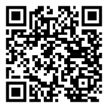

# Cheat Sheet — "Graph of Wisdom" Refactoring

Rebuild the **dashboard** service's read model from an **event stream** instead of a
single stored snapshot. Every notification the dashboard receives is persisted as an
immutable `NotificationEvent`; the current `SessionDashboardData` is then *derived on
demand* by replaying (folding) those events in order — a step toward event sourcing.
The accumulated stream is the "graph of wisdom" the dashboard reads its state from.

📺 Walkthrough video: https://www.youtube.com/watch?v=vdA2W2sR7Ek
📦 GitHub repository: https://github.com/AndiKleini/quizzler

Scan with your phone:

| 📺 Walkthrough video | 📦 GitHub repository |
|:---:|:---:|
|  |  |

> This refactoring lives on the **.NET dashboard** service (`api/dashboard/`), built
> with .NET / EF Core / SQL Server / RabbitMQ, tested with NUnit + Moq + Shouldly.

## The four refactoring steps

Each step is one reviewable move, developed test-first (failing tests, then the code):
first *store* the events, then *read* them, then *fold* them into state, then *switch*
the live read path over to the stream.

| Step | Branch | What it does |
|------|--------|--------------|
| 1 | `refactor-to-stream-step-1` | **Persist** notification events. New `NotificationEvent` entity (`SessionId`, `Type`, `Details` JSON, `TimeStamp`) + EF migration; `StreamNotificationEventHandlerService` writes every received event through `NotificationEventRepository.AddAsync`. Nothing reads them yet. |
| 2 | `refactor-to-stream-step-2` | **Retrieve** events. Add `NotificationEventRepository.GetNotificationEventsForDashboardId(dashboardId)` to load all persisted events for one dashboard/session. |
| 3 | `refactor-to-stream-step-3` | **Build** `SessionDashboardData` from the stream. `SessionDashboardService.GetDashboardFromNotificationEvents` folds the events: each event's `Details` JSON is deserialized by `Type` (`Answer` → `AnswerDto`, `PurchaseConfirmation` → `QuizAttemptPurchaseConfirmationDto`), and each update `ApplyTo`s the accumulating `SessionDashboardData`. |
| 4 | `refactor-to-stream-step-4` | **Activate** the stream path. `SessionDashboardController` falls back to `GetDashboardFromNotificationEvents` when no stored snapshot exists; `NotificationHandlerServiceFactory` chooses the stored vs. stream handler per dashboard (`repository.Exists(dashboardId)`); services wired up in `Program.cs`. |

> Net effect: the dashboard's state is reconstructable by replaying its event
> history, rather than depending on a single mutable stored aggregate.

## Fold: from event stream to dashboard state (step 3)

```
NotificationEvents (ordered stream for one dashboardId)
  ┌──────────────┐  ┌──────────────┐  ┌──────────────┐
  │ Type=Purchase│  │ Type=Answer  │  │ Type=Answer  │  ...
  │ Details=JSON │  │ Details=JSON │  │ Details=JSON │
  └──────┬───────┘  └──────┬───────┘  └──────┬───────┘
         │ deserialize by Type                │
         ▼                 ▼                  ▼
   Confirmation-        AnswerDto          AnswerDto
   Dto.ApplyTo()      .ApplyTo()          .ApplyTo()
         └──────────────► SessionDashboardData ◄──────────┘
                    (accumulated read model)
```

Event types (`NotificationEventType`): `PurchaseConfirmation = 1`, `Answer = 2`.
Each DTO implements `ISessionDashboardUpdate.ApplyTo(dashboard, timeStamp)`.

## RabbitMQ setup (dashboard consumer)

The dashboard's `NotificationEventListener` (a `BackgroundService`) declares its
topology and consumes notification events off the broker:

| Element | Value | Notes |
|---------|-------|-------|
| Exchange | `quizzler.exchange` | type **topic**, durable |
| Routing key | `quizzler.notifications` | binds queue to exchange |
| Queue | `quizzler.notifications` | durable |
| Consumer | `NotificationEventListener` | hosted `BackgroundService`, wired in `Program.cs` |

All names are overridable via `RabbitMQ:*` configuration keys (defaults shown).

**Broker / connection** (shared `quizzler-mq` broker, see `docker-compose.yml`):

```
host      localhost      (service name: quizzler-mq inside compose/kind)
AMQP port 5672
mgmt UI   http://localhost:15672
username  quizzler-mq
password  quizzler-mq
vhost     quizzler
```

> New to the exchange/queue/routing-key model? See the RabbitMQ primer and diagram
> in [`loading-spinner-on-the-move.md`](loading-spinner-on-the-move.md).

## Build & test commands

Dashboard service (`api/dashboard/Dashboard/`), tests live in the same project
(NUnit + Moq + Shouldly):

```bash
cd api/dashboard/Dashboard
dotnet build          # build the service
dotnet test           # run the unit tests
```

Infrastructure the service needs at runtime:

```bash
docker compose up -d dashboard-db   # SQL Server (localhost:1433)
docker compose up -d quizzler-mq    # RabbitMQ broker
docker compose up -d                # full stack (dashboard-api on :8082)
```

EF Core migrations are applied against `dashboard-db`; new migrations are created
with `dotnet ef migrations add <Name>` from the `Dashboard` project.
