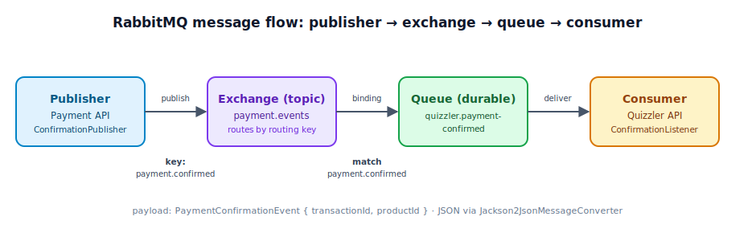

# Cheat Sheet — "Loading Spinner on the Move" Refactoring

Decoupling the **payment API** from the **quizzler API**: replace the direct,
synchronous HTTP success-webhook call with asynchronous **RabbitMQ** events.
The browser's loading spinner keeps spinning on the quiz-attempt-purchase-confirmed
screen until the confirmation event has propagated through the broker and the
quizzler API has confirmed the purchase — hence "the spinner on the move".

📺 Walkthrough video: https://www.youtube.com/watch?v=81CNYRPgmMA
📦 GitHub repository: https://github.com/AndiKleini/quizzler

Scan with your phone:

| 📺 Walkthrough video | 📦 GitHub repository |
|:---:|:---:|
|  |  |

## The three refactoring steps

The refactoring is split into three commits, each living on its own branch so the
transition is reviewable one safe move at a time (publisher first, consumer next,
old path removed last — the broker carries traffic before the direct call is cut).

| Step | Branch | What it does |
|------|--------|--------------|
| 1 | `refactor-direct-dependency-step-1` | **Publish** payment confirmation on RabbitMQ. Payment API's `PaymentConfirmationService` now also publishes a `PaymentConfirmationEvent` (transactionId, productId) via `PaymentConfirmationPublisher` to the topic exchange — *alongside* the existing webhook, so nothing breaks yet. |
| 2 | `refactor-direct-dependency-step-2` | **Consume** the events. Quizzler API adds a `PaymentConfirmationListener` (`@RabbitListener`) that receives the event and calls `QuizAttemptPurchaseService.confirmPurchase(productId, transactionId)`. Both paths now run in parallel. |
| 3 | `refactor-direct-dependency-step-3` | **Remove the direct dependency.** Drop the `ConfirmationWebhookClient` call (and its constructor dependency) from the payment service. Confirmation now flows *only* over RabbitMQ — payment no longer knows about quizzler. |

> Net effect across the steps: payment → quizzler goes from a hard HTTP webhook
> coupling to a fire-and-forget event on a shared broker contract.

## RabbitMQ in a nutshell

RabbitMQ never lets a publisher talk to a queue directly. Messages always flow
**publisher → exchange → (binding) → queue → consumer**:

<p align="center">
  
</p>


- **Exchange** — the entry point. Publishers send every message to an exchange,
  never straight to a queue. The exchange's job is to decide *which* queues (if
  any) get a copy, based on the message's **routing key** and the bindings.
- **Queue** — a buffer that stores messages until a consumer processes them. A
  *durable* queue survives a broker restart. Consumers subscribe to queues.
- **Binding** — a rule that links an exchange to a queue, usually with a routing
  key pattern. No binding ⇒ the exchange drops the message.
- **Routing key** — a label the publisher stamps on each message; the exchange
  matches it against bindings to route the message.

The exchange **type** decides the matching rule. A **topic** exchange matches the
routing key against binding patterns with wildcards (`*` = one word, `#` = zero or
more words, dot-separated), which makes it easy to add more event types and more
consumers later without touching the publisher.

In this refactoring: payment publishes to the `payment.events` topic exchange with
routing key `payment.confirmed`; a binding routes that to the durable
`quizzler.payment-confirmed` queue; the quizzler listener consumes it. Adding, say,
a `payment.cancelled` event or a second consumer later needs only a new
binding/queue — the publisher stays untouched.

## RabbitMQ setup

Shared messaging contract between the two services (declared in each app's
`config/RabbitConfig.java`):

| Element | Value | Notes |
|---------|-------|-------|
| Exchange | `payment.events` | type **topic** — owned/declared by both, shared contract |
| Routing key | `payment.confirmed` | published by payment, bound by quizzler |
| Queue | `quizzler.payment-confirmed` | **durable**, owned by the quizzler consumer |
| Binding | queue → exchange with key `payment.confirmed` | declared in the quizzler `RabbitConfig` |
| Message converter | `Jackson2JsonMessageConverter` | built from the Spring `ObjectMapper` so JSR-310 types (e.g. `Instant`) (de)serialize |

**Broker / connection** (see `docker-compose.yml` service `quizzler-mq`,
image `rabbitmq:3-management-alpine`, and each app's `application.properties`):

```
host      localhost      (service name: quizzler-mq inside compose/kind)
AMQP port 5672
mgmt UI   http://localhost:15672
username  quizzler-mq
password  quizzler-mq
vhost     quizzler
```

## Build & test commands

Payment API (`api/payment/`):

```bash
cd api/payment
mvn -DskipTests package   # build the jar
mvn test                  # run tests
```

Quizzler API (`api/quizzler/`):

```bash
cd api/quizzler
mvn -DskipTests package   # build the jar
mvn test                  # run tests
```

Bring up the broker (and the rest of the stack) locally:

```bash
docker compose up -d quizzler-mq   # RabbitMQ only
docker compose up -d               # full stack
```
